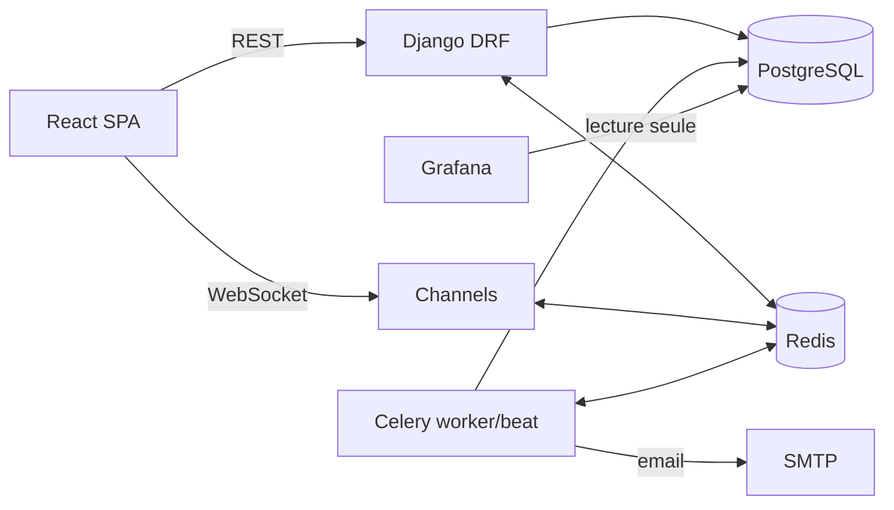

# Architecture — l'essentiel (AMM INNOV)

Version condensée de [architecture.md](architecture.md). Produit décrit dans [prd.md](prd.md).

## En une phrase
Une application web React/Django qui remplace le classeur Excel de suivi des AMM en Afrique, calcule les statuts, alerte 6 mois avant expiration, et diffuse les changements en temps réel.

## Stack
| Couche | Choix |
|---|---|
| Frontend | React 19 + TypeScript, Vite, MUI + Data Grid, TanStack Query, Zustand |
| Backend | Django 5.1 + DRF, Django Channels (WebSocket), Celery + beat, JWT (simplejwt), django-prometheus |
| Données | PostgreSQL 16, Redis 7 (channel layer + broker) |
| Pilotage | Grafana 11 sur vues SQL en lecture seule |
| Infra | Docker Compose, nginx, GitHub Actions |

## Schéma

## Modèle de données (cœur)
- **Country** : iso2, autorité, `validity_years` (5), `filing_lead_months` (6).
- **Product** → **ProductRange** (Générale, Cardio, Bien-être) ; **ProductAlias** conserve les libellés Excel.
- **MarketingAuthorization** (unique produit × pays) : numéro et dates d'origine, `dossier_state`, champs calculés `status`, `urgency`, `effective_end_date`, `filing_deadline`.
- **Renewal** (historique complet) : `workflow_status` PLANIFIE → EN_PREPARATION → DEPOSE → EN_INSTRUCTION → OBTENU | REJETE | ABANDONNE, numéro, dates.
- **AlertRule** (globale ou par pays) → **Alert** (unique AMM × règle × échéance) → **Notification** (in-app, email).
- **Document** : scan PDF rattaché à l'AMM d'origine ou à un renouvellement, `kind` (AMM, récépissé, courrier), `document_date`, `sha256`, `version`/`replaces_id`, archivage logique.
- **ImportBatch/ImportRow**, historique par `django-simple-history`.

## Règles clés
- `date_fin = date_debut + 5 ans` (paramétrable par pays, surcharge manuelle tracée).
- Statut, transcription de la formule Excel : dernier renouvellement obtenu → sa date de fin ; sinon date de fin d'origine ; `VALIDE` si ≥ aujourd'hui, `EXPIRE` sinon ; `IN_PROCESS` si un dépôt est en cours ; `INDETERMINE` si aucune date exploitable.
- Urgence : OK (> 12 mois), A_PLANIFIER (6–12), DEPOT_URGENT (≤ 6 sans dépôt), CRITIQUE (≤ 3 sans dépôt), EXPIRE, EN_INSTRUCTION.
- Alertes par défaut : J-365, **J-180 (deadline de dépôt)**, J-90, J-30, J0, décision en retard, dossier incomplet. Résolution automatique dès qu'un dépôt ou une obtention est enregistré.

## Flux temps réel
Mutation → signal Django → `realtime.publish(groupe, {type, id})` → Redis → WebSocket → le client invalide les requêtes TanStack Query concernées et recharge via l'API (les permissions restent côté serveur). Groupes : `user.{id}`, `country.{iso2}`, `global`. Repli en polling 60 s.

## Jobs planifiés (Celery beat, `Africa/Dakar`)
| Heure | Tâche |
|---|---|
| 00:05 | `recompute_all_statuses` |
| 00:15 | `evaluate_alert_rules` puis dispatch des notifications |
| 00:30 | `refresh_analytics_views` |
| Lundi 08:00 | `send_weekly_digest` |

## API (extraits)
`POST /auth/login` · `GET /amms?country=SN&urgency=DEPOT_URGENT` · `PATCH /amms/{id}` · `POST /renewals/{id}/transition` · `GET /amms/{id}/documents?group=period` · `POST /amms/{id}/documents` · `GET /documents/{id}/file` · `GET /amms/{id}/documents/archive.zip` · `GET /alerts?status=OPEN` · `POST /alerts/{id}/acknowledge` · `GET /analytics/africa` · `POST /imports` · schéma OpenAPI sur `/api/schema`.

## Rôles (trois acteurs)
`COUNTRY_REGULATORY` : réglementaire pays, dépose et suit les AMM de ses pays · `HQ_REGULATORY` : réglementaire siège, coordonne tous les pays et gère les réglementaires pays · `CEO_ADMIN` : le CEO, administrateur, vue d'ensemble. Filtrage des querysets par périmètre pays. Diagrammes de cas d'utilisation, de classes, de séquence et d'activités dans [docs/conception.md](docs/conception.md).

## Import Excel
Onglets au format normalisé à 12 colonnes uniquement ; mapping nom d'onglet → pays ; normalisation gammes et libellés produits ; dates texte parsées sinon ligne en erreur ; numéros d'AMM forcés en chaîne ; statut recalculé et comparé à l'Excel ; rapport par onglet. Contrôle final : reproduire les totaux de l'onglet DASHBOARD (1 548 AMM, 963 valides, 501 expirées, 71 en cours, 13 indéterminées).

## Gestion documentaire (scans PDF)
- Stockage hors base via `django-storages` : volume chiffré en dev, MinIO/S3 en production ; chemin `documents/{pays}/{produit}/{amm}/{AAAA-MM-JJ}_{type}_v{n}.pdf`.
- Upload validé (MIME réel, ≤ 25 Mo, images converties en PDF, PDF assainis), SHA-256 anti-doublon, miniature générée en Celery.
- **Tri canonique du plus récent au plus ancien** : `document_date DESC, uploaded_at DESC`, groupé par période (renouvellement en vigueur → … → AMM d'origine). Même ordre dans l'API, la visionneuse, les bibliothèques pays/produit et le ZIP.
- Accès par URL signée après contrôle du périmètre pays ; remplacement versionné, suppression logique, purge après 5 ans.
- Frontend : onglet Documents de la fiche AMM (frise inverse, visionneuse pdf.js, glisser-déposer), indicateur « scan manquant » dans la grille.

## Grafana
Rôle `grafana_ro` sur le schéma `analytics` (`v_amm_current`, `mv_country_kpi`, `mv_expiry_pipeline`, `v_alert_open`, `v_renewal_funnel`, `v_data_quality`). Cinq dashboards provisionnés en JSON : Vue direction, Pipeline d'expiration, Renouvellements, Qualité des données, Technique. Alerting Grafana réservé au technique.

## Services Docker
`postgres`, `redis`, `backend` (Daphne), `worker`, `beat`, `frontend`, `grafana`, `mailpit` (dev), `minio` (scans PDF). Production : même compose + nginx TLS.

## Décisions structurantes
1. Statut dénormalisé et recalculé chaque nuit, plutôt que calculé à la volée.
2. Les événements WebSocket ne portent que des identifiants ; les données passent toujours par l'API.
3. Les alertes métier vivent dans l'application ; Grafana observe, il ne décide pas.
4. Client API généré depuis OpenAPI pour un typage bout en bout.
5. Monorepo ; le classeur Excel est importé une fois puis décommissionné.
6. Scans PDF stockés hors base (S3/MinIO), versionnés, jamais écrasés ; un seul ordre chronologique inverse défini côté serveur.
