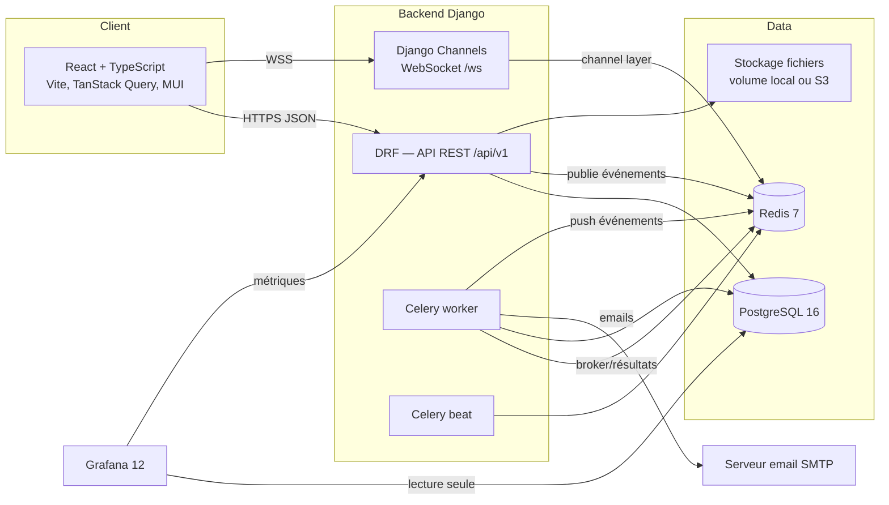
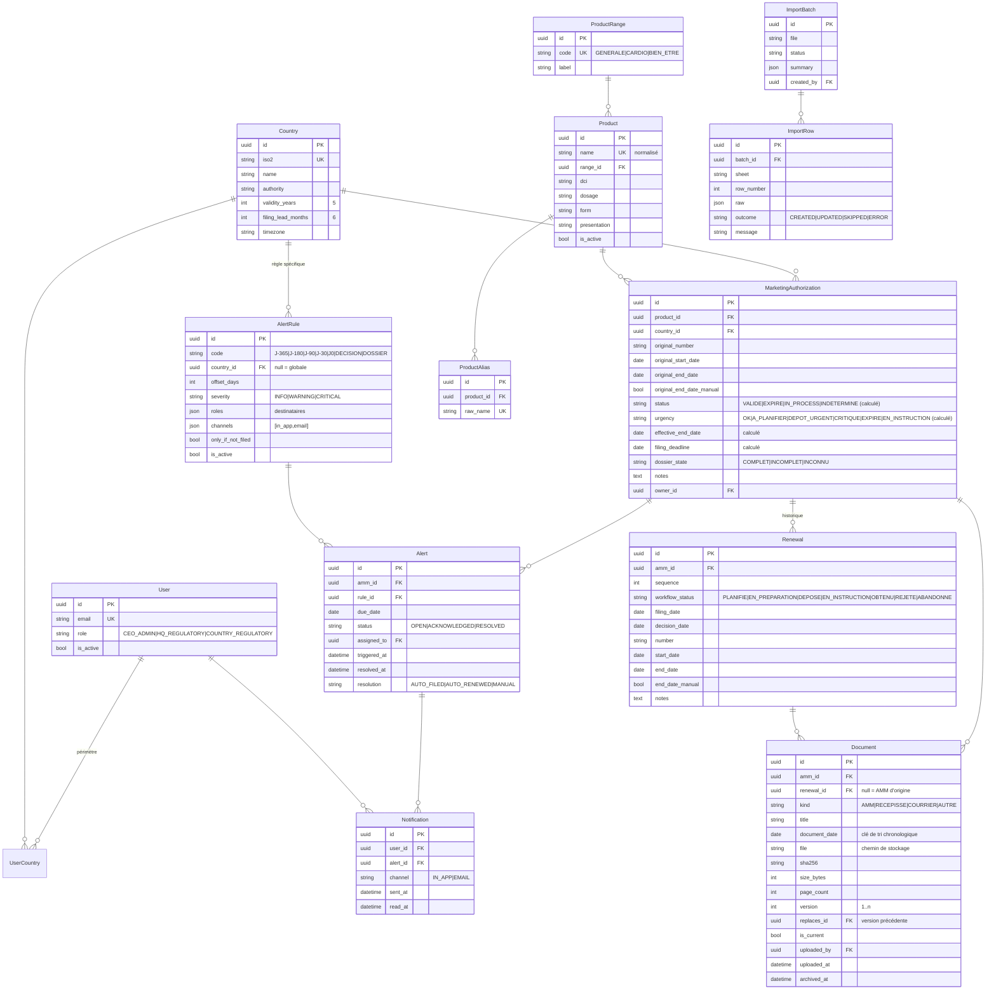
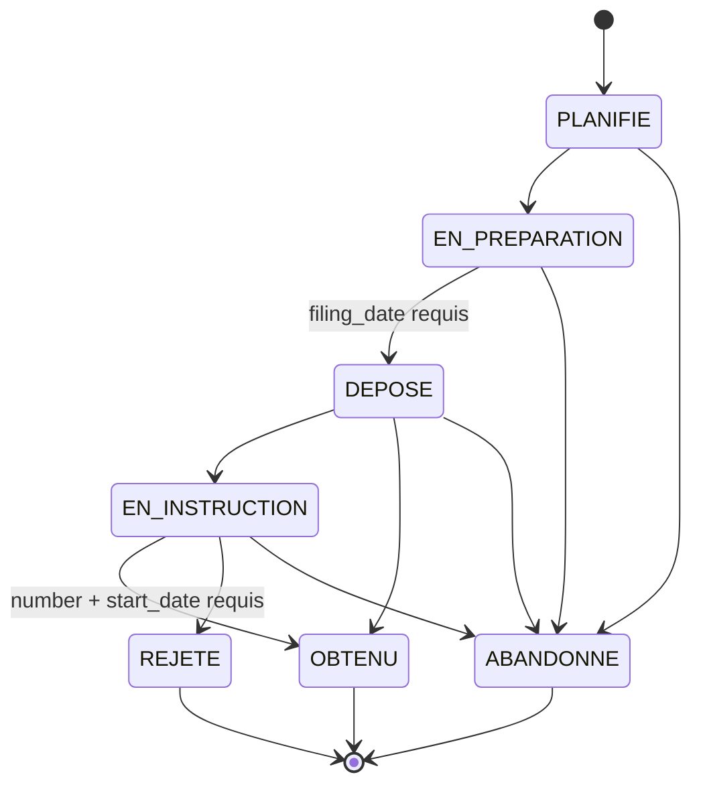

# Architecture logicielle — AMM INNOV

| Champ | Valeur |
|---|---|
| Version | 1.0 |
| Date | 04/09/2026 |
| Document lié | [prd.md](prd.md) |
| Résumé | [architecture-essentiels.md](architecture-essentiels.md) |
| Conception UML | [docs/conception.md](docs/conception.md) |

---

## 1. Vue d'ensemble



### Principes
1. **Une seule source de vérité** : PostgreSQL. Les statuts sont dénormalisés en base pour l'indexation, mais toujours recalculés par un service unique (`amm/services/status.py`).
2. **Événementiel léger** : chaque mutation métier émet un événement de domaine (signal Django) qui alimente le WebSocket, l'audit et, si besoin, les alertes. Pas de bus externe au MVP.
3. **Traitements différés en Celery** : recalcul quotidien, évaluation des règles d'alerte, envoi d'emails, digest, import Excel.
4. **Grafana en lecture seule** sur des vues SQL dédiées ; il ne remplace pas les écrans opérationnels de l'application.
5. **Tout est conteneurisé** ; un `docker compose up` suffit pour développer.

---

## 2. Stack et versions

| Couche | Technologie | Version | Rôle |
|---|---|---|---|
| Frontend | React, TypeScript, Vite | 19 / 5.x / 6 | SPA |
| UI | MUI (Material UI) + MUI X Data Grid | 6 | Composants, grille éditable type Excel |
| État serveur | TanStack Query | 5 | Cache, invalidation via WebSocket |
| État client | Zustand | 5 | Session, préférences, connexion WS |
| Formulaires | React Hook Form + Zod | | Validation typée |
| Graphiques | Recharts | 2 | Dashboards applicatifs |
| i18n | i18next | | FR par défaut |
| Backend | Python, Django, Django REST Framework | 3.12 / 5.1 / 3.15 | API |
| Temps réel | Django Channels + channels-redis + Daphne | 4 | WebSocket |
| Tâches | Celery + django-celery-beat | 5.4 | Jobs planifiés et asynchrones |
| Métriques | django-prometheus + collecteur applicatif (`apps/core/metrics.py`) | | `/metrics` : HTTP, AMM par statut, WebSocket, emails, tâches Celery (compteurs partagés via Redis) |
| Auth | djangorestframework-simplejwt | 5 | JWT access 15 min + refresh 7 j avec rotation et liste de révocation (tokens dans le corps JSON, refresh conservé côté client) |
| Filtres/Doc | django-filter, drf-spectacular | | Filtrage, OpenAPI 3 |
| Audit | django-simple-history | 3 | Historique des modèles |
| Import | openpyxl, pandas | | Lecture du classeur |
| Base | PostgreSQL | 16 | Données |
| Cache/broker | Redis | 7 | Channel layer, broker Celery, cache |
| Observabilité | django-prometheus, structlog | | Métriques, logs JSON |
| Tableaux de bord | Grafana | 11 | Métier + technique |
| Qualité | ruff, mypy, pytest, ESLint, Prettier, Vitest, Playwright | | Lint et tests |
| CI/CD | GitHub Actions | | Lint, tests, build images |

---

## 3. Structure du dépôt (monorepo)

```
AMM INNOV/
├── backend/
│   ├── config/                 # settings (base/dev/prod), urls, asgi, celery
│   ├── apps/
│   │   ├── accounts/           # User, rôles, périmètre pays, auth JWT
│   │   ├── catalog/            # Country, ProductRange, Product, ProductAlias
│   │   ├── amm/                # MarketingAuthorization, Renewal, services statut
│   │   ├── documents/          # Document (scans PDF), stockage, versions, chronologie, ZIP
│   │   ├── alerts/             # AlertRule, Alert, moteur de règles
│   │   ├── notifications/      # Notification, canaux (in-app, email), digest
│   │   ├── realtime/           # consumers Channels, publication d'événements
│   │   ├── analytics/          # endpoints dashboard, vues SQL, exports
│   │   ├── imports/            # ImportBatch, parseur Excel, normalisation
│   │   └── audit/              # exposition de l'historique
│   ├── tests/
│   ├── manage.py
│   └── pyproject.toml
├── frontend/
│   ├── src/
│   │   ├── app/                # routing, providers, layout
│   │   ├── api/                # client HTTP généré depuis OpenAPI, hooks Query
│   │   ├── features/
│   │   │   ├── auth/
│   │   │   ├── dashboard/
│   │   │   ├── amm/            # liste, fiche, grille éditable, frise renouvellements
│   │   │   ├── renewals/
│   │   │   ├── documents/      # dossier documentaire, visionneuse PDF, upload
│   │   │   ├── alerts/
│   │   │   ├── catalog/
│   │   │   ├── imports/
│   │   │   └── admin/
│   │   ├── realtime/           # hook useWebSocket, dispatch vers Query
│   │   ├── components/         # composants partagés
│   │   ├── lib/                # utils dates, formatage, i18n
│   │   └── types/
│   ├── index.html
│   ├── package.json
│   └── vite.config.ts
├── grafana/
│   ├── provisioning/
│   │   ├── datasources/postgres.yml
│   │   └── dashboards/dashboards.yml
│   └── dashboards/*.json
├── docker/
│   ├── backend.Dockerfile
│   ├── frontend.Dockerfile
│   └── nginx.conf
├── docker-compose.yml
├── docker-compose.prod.yml
├── .github/workflows/ci.yml
├── data/raw/                   # classeur Excel source (hors git)
├── prd.md
├── architecture.md
└── architecture-essentiels.md
```

---

## 4. Modèle de données

### 4.1 Diagramme entité-relation



### 4.2 Contraintes et index
- `MarketingAuthorization` : `UNIQUE (product_id, country_id)` ; index sur `(country_id, status)`, `(effective_end_date)`, `(urgency)`.
- `Renewal` : `UNIQUE (amm_id, sequence)` ; un seul renouvellement en statut non terminal par AMM (contrainte applicative).
- `Alert` : `UNIQUE (amm_id, rule_id, due_date)` empêche les doublons d'alerte.
- `ProductAlias.raw_name` unique, en majuscules, espaces normalisés.
- `Document` : index `(amm_id, document_date DESC, uploaded_at DESC)` qui matérialise l'ordre d'affichage « du plus récent au plus ancien » ; `sha256` indexé pour détecter les doublons ; suppression logique uniquement (`archived_at`).
- Toutes les tables métier sont suivies par `django-simple-history` (tables `*_history`).

### 4.3 Champs calculés
Le service `compute_amm_state(amm)` retourne `effective_end_date`, `filing_deadline`, `status`, `urgency` et les écrit sur l'AMM. Il est appelé :
- dans `save()` de `MarketingAuthorization` et `Renewal` (via signaux `post_save`) ;
- par la tâche quotidienne `recompute_all_statuses` (le statut dépend de la date du jour) ;
- après chaque import.

```python
def compute_amm_state(amm, today):
    last = amm.renewals.filter(workflow_status="OBTENU").order_by("-sequence").first()
    pending = amm.renewals.filter(workflow_status__in=["DEPOSE", "EN_INSTRUCTION"]).exists()

    if last and last.end_date:
        end = last.end_date
    elif amm.original_end_date:
        end = amm.original_end_date
    else:
        end = None

    if end is None:
        status = "IN_PROCESS" if pending else "INDETERMINE"
    elif end >= today:
        status = "VALIDE"
    else:
        status = "IN_PROCESS" if pending else "EXPIRE"

    lead = relativedelta(months=amm.country.filing_lead_months)
    deadline = end - lead if end else None
    urgency = derive_urgency(end, pending, today)
    return State(end, deadline, status, urgency)
```

La règle d'origine du classeur considère qu'un renouvellement marqué `IN PROCESS` rend le statut `IN PROCESS` même si la date de fin est passée ; la transcription ci-dessus conserve ce comportement.

---

## 5. Backend

### 5.1 Découpage en applications Django

| App | Responsabilité | Dépend de |
|---|---|---|
| `accounts` | Modèle `User` personnalisé, rôles, périmètre pays, endpoints auth | — |
| `catalog` | Pays, gammes, produits, alias, fusion de produits | — |
| `amm` | AMM, renouvellements, service de calcul d'état, machine à états | catalog, accounts |
| `documents` | Stockage des scans PDF, versions, chronologie, visionneuse, ZIP | amm, accounts |
| `alerts` | Règles, évaluation, cycle de vie des alertes | amm |
| `notifications` | Fan-out par canal, templates email, digest | alerts, realtime |
| `realtime` | Consumers Channels, `publish(event)` | accounts |
| `analytics` | Agrégats dashboard, vues SQL, exports Excel/CSV | amm |
| `imports` | Parseur Excel, normalisation, rapport | catalog, amm |
| `audit` | API de lecture de l'historique | tous |

### 5.2 API REST (`/api/v1`)

Conventions : JSON, pagination par curseur (50 par page), filtrage `django-filter`, tri `?ordering=`, recherche `?search=`, erreurs au format RFC 7807, schéma OpenAPI généré sur `/api/schema` et documentation sur `/api/docs`.

| Méthode | Route | Description | Rôles |
|---|---|---|---|
| POST | `/auth/login` | Retourne `{access, refresh, user}` | tous |
| POST | `/auth/refresh` / `/auth/logout` | | tous |
| GET | `/me` | Profil, rôle, pays autorisés | tous |
| CRUD | `/users` | Gestion des comptes | CEO_ADMIN |
| CRUD | `/countries`, `/ranges`, `/products` | Référentiels | lecture tous, écriture CEO_ADMIN et HQ_REGULATORY |
| POST | `/products/{id}/merge` | Fusion d'un doublon | CEO_ADMIN |
| GET | `/amms` | Liste filtrable : `country`, `range`, `status`, `urgency`, `dossier_state`, `expires_before`, `search` | selon périmètre |
| POST/PATCH | `/amms`, `/amms/{id}` | Création, édition (édition en ligne incluse) | COUNTRY_REGULATORY (ses pays), HQ_REGULATORY, CEO_ADMIN |
| GET | `/amms/{id}/history` | Historique des changements | selon périmètre |
| GET/POST | `/amms/{id}/renewals` | Historique et création | idem |
| POST | `/renewals/{id}/transition` | `{ "to": "DEPOSE", "filing_date": "..." }` avec validation de la machine à états | idem |
| GET | `/amms/{id}/documents` | Dossier documentaire trié `-document_date, -uploaded_at`, groupé par période (`?group=period`), filtre `kind`, `include_archived` | selon périmètre |
| POST | `/amms/{id}/documents`, `/renewals/{id}/documents` | Upload multipart PDF (ou image convertie), champs `kind`, `document_date`, `title` | COUNTRY_REGULATORY (ses pays), HQ_REGULATORY, CEO_ADMIN |
| GET | `/documents/{id}` | Métadonnées, versions précédentes | selon périmètre |
| GET | `/documents/{id}/file` | Flux PDF via URL signée courte durée (`Content-Disposition: inline` pour la visionneuse, `attachment` avec `?download=1`) | selon périmètre |
| POST | `/documents/{id}/replace` | Nouvelle version ; l'ancienne passe `is_current=false` | idem écriture |
| DELETE | `/documents/{id}` | Archivage logique | CEO_ADMIN |
| GET | `/amms/{id}/documents/archive.zip` | ZIP du dossier complet, fichiers nommés et ordonnés par date décroissante | selon périmètre |
| GET | `/countries/{iso2}/documents`, `/products/{id}/documents` | Bibliothèques pays et produit, même tri | selon périmètre |
| GET | `/alerts` | Filtrable : `status`, `country`, `severity`, `assigned_to=me` | selon périmètre |
| POST | `/alerts/{id}/acknowledge`, `/assign`, `/resolve` | Cycle de vie | idem |
| CRUD | `/alert-rules` | Paramétrage | CEO_ADMIN, HQ_REGULATORY |
| GET | `/notifications`, POST `/notifications/{id}/read`, `/notifications/read-all` | Centre de notifications | tous |
| GET | `/analytics/africa` | Tableau pays × indicateurs (équivalent onglet DASHBOARD) | tous |
| GET | `/analytics/country/{iso2}` | Répartition, pipeline 24 mois | selon périmètre |
| GET | `/analytics/product/{id}/coverage` | Couverture pays | tous |
| GET | `/analytics/export?format=xlsx` | Export de la vue filtrée | tous |
| POST | `/imports` | Upload du classeur ; GET `/imports/{id}` pour suivre le rapport | CEO_ADMIN, HQ_REGULATORY |
| GET | `/metrics` | Prometheus | réseau interne |
| GET | `/health` | Liveness/readiness | public |

### 5.3 Permissions
- Classe `IsInCountryScope` : filtre les querysets sur `request.user.countries` pour `COUNTRY_REGULATORY` ; `HQ_REGULATORY` et `CEO_ADMIN` voient tout.
- Classe `RolePermission` : matrice rôle × action. `COUNTRY_REGULATORY` écrit sur les AMM, renouvellements, documents et alertes de ses pays ; `HQ_REGULATORY` écrit sur tous les pays, gère les référentiels, les règles, les imports et les comptes `COUNTRY_REGULATORY` ; `CEO_ADMIN` a tous les droits, dont la gestion des comptes siège et l'archivage des documents.
- Acteurs et cas d'utilisation : voir [docs/conception.md](docs/conception.md).

### 5.4 Machine à états des renouvellements


Implémentée avec `django-fsm-2` ; chaque transition émet un événement `renewal.transitioned` et déclenche `compute_amm_state` puis `alerts.reconcile(amm)`.

### 5.5 Moteur d'alertes

Tâche Celery `evaluate_alert_rules` exécutée chaque jour à 00:15 (`Africa/Dakar`), après `recompute_all_statuses` :

1. Pour chaque règle active, résoudre la règle applicable par pays (règle pays > règle globale).
2. Sélectionner les AMM dont `effective_end_date - offset_days <= today` et `status != EXPIRE` (sauf règle `J0`), et sans renouvellement déposé si `only_if_not_filed`.
3. Créer l'`Alert` si `(amm, rule, due_date)` n'existe pas ; `due_date = effective_end_date - offset_days`.
4. Pour chaque alerte créée, appeler `notifications.dispatch(alert)`.

`alerts.reconcile(amm)` est appelé sur toute mutation d'AMM : il résout automatiquement les alertes ouvertes devenues sans objet (renouvellement déposé ou obtenu) avec la résolution `AUTO_FILED` ou `AUTO_RENEWED`.

### 5.6 Notifications

`notifications.dispatch(alert)` :
1. Résout les destinataires : utilisateurs actifs ayant un rôle listé dans `rule.roles` et le pays dans leur périmètre (les rôles globaux reçoivent tout).
2. Pour chaque destinataire et chaque canal de la règle, crée une `Notification`.
3. Canal `IN_APP` : publie l'événement `notification.created` sur le groupe WebSocket `user.{id}`.
4. Canal `EMAIL` : tâche `send_alert_email` (template HTML + texte, lien profond vers l'AMM, retry exponentiel 3 fois).

Digest hebdomadaire : tâche `send_weekly_digest` le lundi 08:00, un email par utilisateur regroupant ses pays ; non envoyé si vide.

### 5.7 Temps réel (Django Channels)

- Endpoint `wss://…/ws/`, jeton d'accès transmis dans le sous-protocole `Sec-WebSocket-Protocol: amm.jwt, <access>` (jamais dans l'URL) ; authentification JWT dans le middleware ASGI.
- Groupes :
  - `user.{id}` : notifications personnelles ;
  - `country.{iso2}` : mutations d'AMM, de renouvellements et d'alertes du pays ;
  - `global` : rafraîchissement dashboard, référentiels.
- L'abonnement aux groupes pays est calculé côté serveur à partir du périmètre de l'utilisateur ; le client ne choisit pas ses groupes.
- Événements (JSON) : `{ "type": "amm.updated", "id": "...", "country": "SN", "version": 12 }`. Le client n'utilise que l'identifiant et invalide les requêtes TanStack Query concernées ; les données complètes sont rechargées par l'API, ce qui garantit le respect des permissions.
- Publication depuis le backend via `realtime.publish(group, event)` (wrapper sur `channel_layer.group_send`), appelé dans des signaux `post_save`/`post_delete` et dans les tâches Celery.
- Repli : si le WebSocket est indisponible, le client passe en polling toutes les 60 s.

### 5.8 Tâches Celery

| Tâche | Planification | Description |
|---|---|---|
| `recompute_all_statuses` | 00:05 quotidien | Recalcule `status`, `urgency`, `effective_end_date`, `filing_deadline` ; publie `dashboard.refresh` |
| `evaluate_alert_rules` | 00:15 quotidien | Voir 5.5 |
| `send_alert_email` | à la demande | Envoi email avec retry |
| `send_weekly_digest` | lundi 08:00 | Digest par utilisateur |
| `run_import` | à la demande | Traite un `ImportBatch` |
| `refresh_analytics_views` | 00:30 quotidien et après import | `REFRESH MATERIALIZED VIEW CONCURRENTLY` |
| `cleanup_notifications` | dimanche 03:00 | Purge des notifications lues > 90 jours |
| `generate_document_preview` | à la demande | Miniature et comptage de pages d'un scan PDF |
| `build_documents_archive` | à la demande | Construit le ZIP d'un dossier documentaire volumineux et notifie le lien |
| `purge_archived_documents` | 1er janvier 04:00 | Suppression physique des documents archivés depuis plus de 5 ans |

### 5.9 Import Excel

Module `imports/excel_parser.py` :
1. Ouvre le classeur avec `openpyxl` en `data_only=True`.
2. Ne retient que les onglets dont la ligne 2 correspond à l'en-tête normalisé (`NBR, NBR, GAMME, NOM, DATE DEBUT, N° AMM, DATE FIN, DATE DEBUT, N° AMM, DATE FIN, STATUT, ETAT DOSSIER`). Les onglets `DASHBOARD` et les anciens formats à 3 blocs sont ignorés avec avertissement.
3. Mappe le nom d'onglet vers un pays (`CDI` → `CI`, `SENEGAL ` → `SN`, etc.) via une table de correspondance ; onglet inconnu = erreur bloquante pour cet onglet.
4. Par ligne : normalise la gamme, normalise le libellé produit (majuscules, trim, espaces multiples, `B/30`≈`B30`), cherche un `ProductAlias`, sinon crée le produit et l'alias.
5. Convertit les dates (datetime Excel ou texte `JJ/MM/AAAA`, `JJ-MM-AAAA`, `JJ.MM.AAAA`) ; échec → ligne en `ERROR` avec message « date illisible ».
6. Convertit les numéros d'AMM en chaîne (suppression du `.0`).
7. Crée ou met à jour l'AMM (clé produit + pays) ; crée un `Renewal` `OBTENU` si un renouvellement avec date est présent, ou un `Renewal` `DEPOSE` si la valeur est `IN PROCESS`.
8. Recalcule l'état et compare avec la colonne `STATUT` du classeur ; toute divergence est consignée en `WARNING` dans `ImportRow.message`.
9. Résumé dans `ImportBatch.summary` : créées, mises à jour, ignorées, erreurs, divergences de statut, par onglet.

L'import est transactionnel par onglet.

### 5.10 Configuration
Variables d'environnement (fichier `.env`, jamais commité, `.env.example` fourni) : `DJANGO_SECRET_KEY`, `DATABASE_URL`, `REDIS_URL`, `ALLOWED_HOSTS`, `CORS_ALLOWED_ORIGINS`, `EMAIL_URL`, `DEFAULT_FROM_EMAIL`, `FRONTEND_URL`, `STORAGE_BACKEND=filesystem|s3`, `MEDIA_ROOT` ou `S3_ENDPOINT_URL`/`S3_BUCKET`/`S3_ACCESS_KEY`/`S3_SECRET_KEY`, `DOCUMENT_MAX_MB=25`, `TIME_ZONE=Africa/Dakar`, `SENTRY_DSN` (optionnel).

### 5.11 Gestion documentaire (scans PDF des AMM)

**Objectif** : conserver pour chaque AMM le scan PDF de chaque autorisation délivrée (origine et renouvellements), des récépissés de dépôt et des courriers, et les présenter du plus récent au plus ancien.

**Stockage**
- Backend `django-storages` avec deux implémentations interchangeables : système de fichiers (volume Docker chiffré, défaut en dev) et stockage objet compatible S3 (MinIO auto-hébergé ou service cloud, recommandé en production).
- Chemin déterministe : `documents/{iso2}/{product_slug}/{amm_id}/{document_date:%Y-%m-%d}_{kind}_{version}_{uuid8}.pdf`. Le préfixe date garantit qu'un listage brut du stockage est lui aussi chronologique.
- Les fichiers ne sont jamais servis directement par nginx : l'API vérifie le périmètre pays puis renvoie une URL signée (S3) ou diffuse le flux (filesystem) avec expiration à 5 minutes.
- Empreinte SHA-256 calculée à l'upload ; un doublon strict sur la même AMM est refusé avec un message explicite.
- Suppression logique uniquement (`archived_at`) ; purge physique par tâche annuelle après 5 ans, conforme à l'exigence de conservation.

**Pipeline d'upload** (`documents/services/ingest.py`)
1. Validation : MIME réel (`python-magic`) parmi PDF, JPEG, PNG ; taille ≤ `DOCUMENT_MAX_MB`.
2. Conversion des images en PDF (`img2pdf`) ; les PDF sont passés dans `pikepdf` pour réparation légère et suppression du JavaScript embarqué.
3. Comptage des pages et génération d'une miniature de la première page (`pdf2image`, 200 px) en tâche Celery `generate_document_preview`.
4. `document_date` : valeur fournie, sinon date de début du renouvellement rattaché, sinon date de début de l'AMM d'origine.
5. Écriture du `Document`, publication de l'événement `document.created` sur `country.{iso2}`, entrée d'audit.

**Chronologie inverse**
- Tri canonique appliqué partout (API, ZIP, exports) : `ORDER BY document_date DESC, uploaded_at DESC`.
- Le sérialiseur `AmmDocumentsSerializer` regroupe par période d'autorisation : `[renouvellement N (en vigueur), …, renouvellement 1, AMM d'origine]`, chaque groupe portant ses documents triés. Le premier élément est donc toujours le scan de l'AMM en vigueur.
- Un `Document` peut être rattaché à un `Renewal` ; sans rattachement il appartient à la période d'origine.

**Versions**
- `replace` crée un nouveau `Document` avec `version = n+1`, `replaces_id` pointant vers l'ancien, qui passe `is_current=false`. Les listes n'affichent que `is_current=true` sauf `include_archived=1`.

**Frontend**
- Onglet « Documents » de la fiche AMM : frise verticale, du haut (le plus récent) vers le bas (le plus ancien), séparateurs par période, badge « En vigueur » sur le premier scan d'AMM.
- Visionneuse PDF intégrée (`react-pdf`, moteur pdf.js) avec zoom, pagination, ouverture dans un nouvel onglet ; miniatures en liste.
- Upload par glisser-déposer avec formulaire de métadonnées (type, date, titre) ; barre de progression ; détection de doublon affichée avant envoi grâce au hachage côté client (`SubtleCrypto`).
- Indicateur « scan présent / manquant » dans la grille des AMM et filtre `has_current_scan=false`.

**Évolution V2** : OCR (`ocrmypdf` + Tesseract) pour rendre les scans cherchables et pré-remplir numéro et dates d'AMM.

---

## 6. Frontend

### 6.1 Architecture
- **Vite + React 19 + TypeScript strict.** Organisation par fonctionnalité (`features/*`), chaque dossier contenant ses composants, hooks et types.
- **Client API généré** depuis le schéma OpenAPI (`openapi-typescript` + `openapi-fetch`) : types et routes toujours synchronisés avec le backend.
- **TanStack Query** pour tout état serveur ; clés de requêtes centralisées (`queryKeys.amms.list(filters)`, `queryKeys.analytics.africa()`), ce qui rend l'invalidation par événements WebSocket déterministe.
- **Zustand** pour la session (token access en mémoire), les préférences d'affichage et l'état de la connexion temps réel.
- **MUI X Data Grid** pour la liste des AMM : colonnes identiques au classeur, tri, filtres, édition en ligne avec sauvegarde optimiste et rollback en cas d'erreur.
- **Routing** avec React Router 7 ; routes protégées par rôle.

### 6.2 Écrans

| Route | Écran | Contenu |
|---|---|---|
| `/login` | Connexion | |
| `/` | Dashboard Afrique | Tableau pays × indicateurs (reprise Excel), cartes KPI, barre par statut, top priorités |
| `/countries/:iso2` | Dashboard pays | Répartition gamme × statut, pipeline d'expiration 24 mois, liste d'urgences |
| `/amms` | Grille AMM | Data Grid éditable, filtres, export, badges d'urgence |
| `/amms/:id` | Fiche AMM | Détail, frise des renouvellements, onglet Documents (chronologie inverse, visionneuse PDF, upload, ZIP), alertes, historique |
| `/documents` | Bibliothèque documentaire | Tous les scans du périmètre, filtres pays / produit / type / année, tri du plus récent au plus ancien |
| `/renewals/:id` | Renouvellement | Formulaire de transition, documents |
| `/alerts` | Centre d'alertes | Liste, acquittement, assignation |
| `/products`, `/products/:id` | Produits | Fiche, alias, couverture pays |
| `/admin/*` | Administration | Utilisateurs, pays, gammes, règles d'alerte, imports |
| `/imports/:id` | Rapport d'import | Lignes en erreur, corrections |

### 6.3 Temps réel côté client
Hook `useRealtime()` monté à la racine :
- ouvre le WebSocket avec le token courant, reconnexion exponentielle (1 s → 30 s), renouvellement du token avant expiration ;
- reçoit les événements et applique une table `event → queryKeys à invalider` ;
- affiche un toast pour `notification.created` et incrémente le compteur de la cloche ;
- expose `status: 'connected' | 'reconnecting' | 'polling'` pour l'indicateur d'en-tête.

### 6.4 Dates et formats
Toutes les dates API sont ISO 8601 ; affichage en `JJ/MM/AAAA` via `date-fns` avec la locale `fr`. Les délais sont affichés en jours restants et en mois.

---

## 7. Base de données

### 7.1 Rôles PostgreSQL
| Rôle | Droits | Usage |
|---|---|---|
| `amm_app` | propriétaire du schéma `public` | Django |
| `grafana_ro` | `SELECT` sur le schéma `analytics` uniquement | Grafana |

### 7.2 Schéma `analytics` (vues pour Grafana et exports)

| Vue | Type | Contenu |
|---|---|---|
| `v_amm_current` | vue | Une ligne par AMM avec pays, gamme, produit, statut, urgence, date de fin effective, deadline, état du dossier, jours restants |
| `mv_country_kpi` | matérialisée | Équivalent de l'onglet DASHBOARD : totaux par pays et par statut, % valides, expirant < 6 et < 12 mois, % dossiers complets |
| `mv_expiry_pipeline` | matérialisée | Nombre d'AMM par pays et par mois de fin sur 36 mois |
| `v_alert_open` | vue | Alertes ouvertes avec ancienneté et assignation |
| `v_renewal_funnel` | vue | Renouvellements par statut de workflow et délai moyen dépôt → décision |
| `v_data_quality` | vue | AMM indéterminées, dossiers incomplets, produits sans gamme, alias non rapprochés |

Les vues matérialisées sont rafraîchies par `refresh_analytics_views`.

### 7.3 Sauvegardes
`pg_dump` quotidien à 02:00 dans un conteneur dédié, chiffré, rétention 30 jours, test de restauration mensuel documenté. Les scans PDF sont sauvegardés dans le même créneau : `mc mirror` du bucket MinIO ou `restic` sur le volume documents, avec la même rétention ; une restauration vérifie l'empreinte SHA-256 de chaque fichier contre la table `Document`.

---

## 8. Grafana

- Datasource PostgreSQL provisionnée (`grafana/provisioning/datasources/postgres.yml`) avec le rôle `grafana_ro`.
- Datasource Prometheus optionnelle pour `/metrics` du backend.
- Dashboards provisionnés en JSON (versionnés dans le dépôt) :

| Dashboard | Public | Panneaux |
|---|---|---|
| **AMM Afrique — Vue direction** | CEO | Tableau pays (reprise Excel), jauges % valides, carte choroplèthe Afrique, tendance mensuelle du nombre d'AMM valides |
| **Pipeline d'expiration** | Réglementaire | Histogramme par mois et par pays, liste des 50 prochaines échéances, AMM sans dépôt à < 6 mois |
| **Suivi des renouvellements** | Réglementaire | Entonnoir par statut, délai moyen de décision par autorité, taux de rejet |
| **Qualité des données** | Admin | Indéterminées, dossiers incomplets, alias non rapprochés, écarts import |
| **Technique** | Exploitation | Latence API, erreurs 5xx, file Celery, échecs d'email, connexions WebSocket |

- Accès : authentification Grafana propre (ou OAuth ultérieur) ; rôle Grafana `Viewer` pour le CEO et le siège.
- Alerting Grafana utilisé uniquement pour le dashboard technique ; les alertes métier restent dans l'application, source unique de vérité.
- Intégration dans l'application : lien sortant vers Grafana depuis le menu. L'intégration par iframe n'est pas retenue au MVP pour éviter l'accès anonyme.

---

## 9. Infrastructure et déploiement

### 9.1 `docker-compose.yml` (développement)

| Service | Image / build | Ports | Notes |
|---|---|---|---|
| `postgres` | `postgres:16` | 5432 | volume `pgdata`, script d'init créant `grafana_ro` |
| `redis` | `redis:7` | 6379 | |
| `backend` | `docker/backend.Dockerfile` | 8000 | Daphne (ASGI) sert API et WebSocket |
| `worker` | même image | — | `celery -A config worker` |
| `beat` | même image | — | `celery -A config beat` avec `django-celery-beat` |
| `frontend` | `docker/frontend.Dockerfile` | 5173 | Vite dev server ; en prod, build statique servi par nginx |
| `grafana` | `grafana/grafana:12` | 3000 | provisioning monté |
| `mailpit` | `axllent/mailpit` | 8025 | Capture des emails en dev |
| `minio` | `minio/minio` | 9000 / 9001 | Stockage objet S3 des scans PDF (optionnel en dev, recommandé en prod) ; bucket `amm-documents` créé à l'init |

### 9.2 Production
- Serveur unique (VPS 4 vCPU / 8 Go) ou équivalent cloud ; `docker-compose.prod.yml` avec nginx en frontal (TLS via Let's Encrypt, `/api` et `/ws` vers Daphne, `/` statique React, `/grafana` vers Grafana).
- Migrations exécutées au démarrage du conteneur backend (`migrate` puis `collectstatic`).
- Secrets injectés par variables d'environnement.
- Logs JSON collectés par Docker ; Sentry optionnel.

### 9.3 CI/CD (GitHub Actions)
1. `lint` : ruff, mypy, ESLint, Prettier, `tsc --noEmit`.
2. `test-backend` : pytest avec PostgreSQL et Redis en services ; couverture ≥ 80 % sur `amm`, `alerts`, `imports`.
3. `test-frontend` : Vitest ; Playwright sur les parcours critiques (connexion, édition en ligne, acquittement d'alerte).
4. `build` : images Docker taguées par SHA, poussées sur GHCR.
5. `deploy` (manuel ou sur tag) : `docker compose pull && up -d` via SSH.

---

## 10. Sécurité

- JWT access 15 minutes en mémoire côté client ; refresh 7 jours conservé dans le stockage local du navigateur et envoyé dans le corps de `POST /auth/refresh` ; rotation des refresh tokens et liste de révocation à la déconnexion. Le passage du refresh en cookie `httpOnly` est une évolution prévue (voir ADR 14).
- Mots de passe hachés avec l'algorithme par défaut de Django (PBKDF2-SHA256) ; Argon2 et le verrouillage de compte (django-axes) sont des options de durcissement à activer avant la mise en production.
- Limitation de débit DRF sur `/auth/login`.
- CORS restreint à `FRONTEND_URL` ; CSP stricte ; en-têtes de sécurité (django-csp, `SECURE_*`).
- Uploads : type MIME réel vérifié, 25 Mo max, PDF assainis (JavaScript supprimé), stockage hors webroot, accès uniquement par URL signée à durée courte après contrôle du périmètre pays, empreinte SHA-256 pour l'intégrité.
- Validation Zod côté client et serializers DRF côté serveur ; aucune règle de sécurité ne repose sur le client.
- Journal d'audit immuable (historique + utilisateur + IP).
- Dépendances scannées par Dependabot.

---

## 11. Observabilité

- Métriques Prometheus : requêtes par endpoint et code, latence p95, tâches Celery (succès/échec/durée), taille des files, emails envoyés/échoués, connexions WebSocket actives, nombre d'AMM par statut (gauge métier).
- Logs structurés `structlog` avec `request_id` corrélé entre API, Channels et Celery.
- Endpoints `/health/live` et `/health/ready` (base et Redis).
- Alertes techniques Grafana : échec de `evaluate_alert_rules`, file Celery > 100, erreurs 5xx > 1 %.

---

## 12. Stratégie de tests

| Niveau | Outil | Cibles prioritaires |
|---|---|---|
| Unitaire backend | pytest | `compute_amm_state` (table de cas reprenant la formule Excel), machine à états, moteur d'alertes, parseur Excel (fixtures extraites du classeur) |
| Intégration backend | pytest + DRF APIClient | Permissions par pays, transitions, idempotence des alertes, import complet d'un onglet |
| Unitaire frontend | Vitest + Testing Library | Hooks Query, formatage des dates, table d'invalidation WebSocket |
| End-to-end | Playwright | Connexion, filtre et édition en ligne, réception d'une notification en temps réel, acquittement |
| Non-régression données | script | Après import du classeur, le tableau `/analytics/africa` doit reproduire les totaux de l'onglet DASHBOARD (1 548 / 963 / 501 / 71 / 13) |

---

## 13. Décisions d'architecture (ADR résumées)

| # | Décision | Alternatives écartées | Motif |
|---|---|---|---|
| 1 | Statut dénormalisé + recalcul quotidien | Calcul à la volée en SQL | Filtrage et tri indexés sur 2 000+ lignes, simplicité des vues Grafana |
| 2 | Channels + Redis pour le temps réel | Server-Sent Events, polling | Bidirectionnel, groupes par pays, intégration native Django |
| 3 | Événements WS « invalidation » (identifiants seuls) | Envoi des objets complets | Les permissions restent appliquées par l'API ; payloads minimes |
| 4 | Celery + django-celery-beat | Cron système, Django-Q | Planification éditable en base, retries, monitoring |
| 5 | Alertes métier dans l'application, Grafana en lecture seule | Alerting Grafana pour le métier | Une seule source de vérité, acquittement et assignation tracés |
| 6 | MUI X Data Grid | AG Grid, TanStack Table maison | Édition en ligne prête à l'emploi, cohérence MUI |
| 7 | Client API généré depuis OpenAPI | Client écrit à la main | Typage bout en bout, dérive impossible |
| 8 | django-simple-history | pghistory, triggers SQL | Intégration admin et API immédiate |
| 9 | Monorepo | Deux dépôts | Un PR = backend + frontend + dashboards cohérents |
| 10 | Excel importé, jamais synchronisé en continu | Synchronisation bidirectionnelle | Objectif : décommissionner le classeur |
| 11 | Scans PDF hors base, stockage objet S3 via `django-storages`, chemin préfixé par la date | Fichiers en `bytea` PostgreSQL, volume local seul | Sauvegarde et montée en charge indépendantes de la base ; listage naturellement chronologique |
| 12 | Tri chronologique inverse canonique `document_date DESC, uploaded_at DESC` défini dans un seul manager Django | Tri côté client | Un seul ordre partout : API, ZIP, exports, bibliothèques |
| 13 | Versionnage par chaînage `replaces_id` et suppression logique | Écrasement du fichier | Traçabilité réglementaire, restauration possible |
| 14 | Refresh token dans le corps JSON et le stockage local (MVP) | Cookie httpOnly | Simplicité d'intégration SPA et de tests ; migration vers cookie prévue avant exposition Internet |
| 15 | Machine à états écrite à la main dans `services/workflow.py` | django-fsm-2 | Aucune dépendance supplémentaire, transitions et champs requis explicites et testés |
| 16 | Compteurs Celery/emails/WebSocket stockés dans Redis, exposés par un collecteur Prometheus dans le processus web | Métriques par processus | Les processus worker et Daphne ne sont pas scrappés séparément |
