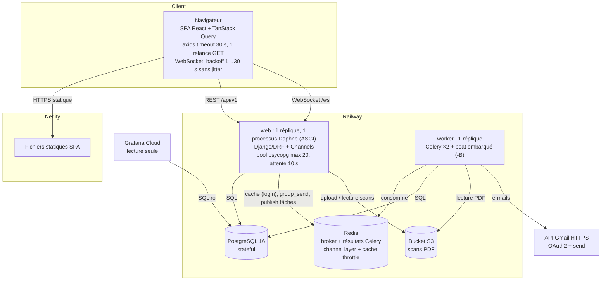

# Phase 1 — Cartographie de l'architecture (avant toute injection de panne)

Établie le 18/09/2026 par lecture du code (commit `6351395`), avant la campagne de chaos.
Les affirmations marquées **H** sont des *hypothèses* à confirmer ou réfuter par un crash test.

## 1. Topologie réellement déployée (Railway + Netlify)

Variante « serveur unique » (`docker-compose.prod.yml`) : Caddy (TLS) → nginx (image frontend,
SPA + proxy `/api`, `/ws`, `/grafana`) → backend (uvicorn ×2) ; worker et beat séparés ;
Redis AOF `maxmemory 256mb noeviction` ; sauvegarde `pg_dump` quotidienne sur le même disque.

## 2. Classement des composants

| Composant | État | Rôle | Réplication | Redémarrage auto |
|---|---|---|---|---|
| SPA (Netlify) | stateless | UI | CDN | n/a |
| web (Daphne) | stateless (sessions JWT) | API + WebSocket | **1 réplique, 1 processus** | Railway `ON_FAILURE` ×5 |
| worker + beat | stateless (état en base) | tâches, planification | **1 réplique** | idem |
| PostgreSQL | **stateful** | source de vérité | **aucune** | plateforme |
| Redis | **stateful** (file des tâches) | broker, résultats, channel layer, cache | **aucune** | plateforme |
| S3 | **stateful** | scans PDF | fournisseur | n/a |
| Gmail API | externe | e-mails d'alerte | n/a | n/a |

## 3. Chemins synchrones et asynchrones

Synchrones (dans la requête HTTP) : toute lecture/écriture SQL ; `realtime.publish()` (Redis)
**dans les signaux post-save, donc à l'intérieur des transactions** ; publication Celery
`task.delay()` dans `transaction.on_commit` ; écriture S3 des scans **à l'intérieur de la
transaction `ingest_document`** ; cache Redis du throttle de connexion.

Asynchrones (Celery) : `send_alert_email` (3 relances, backoff), `generate_document_preview`,
`run_import`, `analyze_dossier` (OCR tesseract), `refresh_analytics_views`, tâches nocturnes
`recompute_all_statuses`, `evaluate_alert_rules`, `send_weekly_digest`, purges.

## 4. Points uniques de défaillance (SPOF)

| # | SPOF | Portée d'une panne |
|---|---|---|
| S1 | Processus web unique | tout (API, WebSocket, uploads) |
| S2 | PostgreSQL unique | tout sauf SPA statique |
| S3 | Redis unique, **4 rôles** | H : connexion, écritures, uploads, temps réel, tâches |
| S4 | Worker unique **portant beat** | e-mails, imports, analyses, **jobs nocturnes (statuts, alertes)** |
| S5 | nginx (variante serveur) : upstream `grafana:3000` résolu au démarrage | H : Grafana absent ⇒ nginx ne démarre pas ⇒ API coupée |
| S6 | Disque unique (variante serveur) : base, médias, journaux **et sauvegardes** | tout, et perte des sauvegardes |

## 5. Hypothèses de défaillance à tester (issues du code)

| H | Hypothèse | Fichier |
|---|---|---|
| H1 | Redis arrêté ⇒ la **connexion** échoue (throttle sur le cache Redis, sans repli) | `accounts/views.py` LoginThrottle |
| H2 | Redis arrêté ⇒ upload/import renvoient 500 **alors que la donnée est enregistrée** (`delay()` lève après commit) | `core/tasks.py` |
| H3 | Redis figé (pas coupé) ⇒ `group_send`, cache, `delay()` et la sonde de santé **attendent sans fin** (aucun `socket_timeout`) ; comme `publish` tourne dans la transaction, les verrous et connexions du pool restent pris ⇒ **panne totale en cascade** | `realtime/publisher.py`, `settings` |
| H4 | S3 lent ou figé ⇒ l'upload garde une transaction et une connexion du pool pendant l'appel S3 (timeouts boto par défaut 60 s × relances) ⇒ saturation du pool | `documents/services/ingest.py` |
| H5 | PostgreSQL figé ⇒ pas de `connect_timeout` ni de `statement_timeout` ⇒ requêtes bloquées jusqu'au timeout nginx (120 s) ou client (30 s) | `settings/base.py` |
| H6 | `PATCH /amms/{id}` n'est pas atomique : UPDATE, historique, réconciliation des alertes en autocommit ⇒ un crash entre deux laisse une **modification sans trace d'audit** | `amm/views.py` (ModelViewSet) |
| H7 | `PATCH` sans verrou ni `update_fields` ⇒ **mise à jour perdue** et statut calculé périmé face à un renouvellement concurrent | `amm/models.py` save() |
| H8 | Remplacement concurrent d'un même document ⇒ **deux versions courantes** | `documents/views.py` replace |
| H9 | Worker tué pendant une tâche ⇒ tâche **perdue** (acks précoces) ; `analyze_dossier` reste `RUNNING` **à vie** et la relance est refusée | `imports/tasks.py` |
| H10 | E-mail en échec après 3 relances ⇒ `sent_at` NULL **sans rattrapage ni alerte** | `notifications/tasks.py` |
| H11 | Crash entre la création d'une alerte et son `dispatch` ⇒ **notification jamais envoyée** (le `get_or_create` suivant la trouve déjà créée) | `alerts/services/engine.py` |
| H12 | Digest hebdomadaire : échec au milieu ⇒ utilisateurs suivants jamais servis ; relance ⇒ doublons | `notifications/tasks.py` |
| H13 | Reconnexion WebSocket sans jitter ⇒ **troupeau** au redémarrage du web ; chaque connexion d'un compte global fait 17 `group_add` Redis (15 pays, `global`, l'utilisateur) | `realtime/useRealtime.ts` |
| H14 | Chaque écriture AMM ⇒ `dashboard.refresh` diffusé à tous ⇒ chaque client recharge `/analytics/africa` : amplification N×M | `amm/signals.py` |
| H15 | Purge : fichier supprimé **avant** la ligne ⇒ crash entre deux = ligne pointant vers un fichier absent | `documents/tasks.py` |
| H16 | ZIP d'archive et upload entièrement en mémoire ⇒ OOM sous uploads/archives concurrents | `documents/services/archive.py` |
| H17 | Point de rupture en charge : 1 processus Python (GIL) ⇒ CPU web saturé bien avant PostgreSQL | `railway.json`, entrypoint |
| H18 | `/health` mélange vivacité et disponibilité (base) ; Redis n'y est qu'informatif | `accounts/views.py` HealthView |

## 6. Retries, timeouts, idempotence (état initial)

| Appel | Timeout | Retry | Risque |
|---|---|---|---|
| Client → API | 30 s (axios) | 1 relance GET, 0 mutation | faible |
| nginx → backend | `proxy_read_timeout 120s` | non | requêtes longues retenues 2 min |
| Django → PostgreSQL | **aucun connect/statement timeout** ; pool 10 s | non | H5 |
| Django → Redis (cache, channels, Celery, health, métriques) | **aucun socket_timeout explicite** (connect 0,5–1 s pour health/métriques seulement) — *mesuré ensuite : redis-py 8 applique 5 s par défaut ; `delay()`, lui, attendait sans fin* | kombu : 3 relances publication | H3 |
| Django → S3 | défauts boto (60 s + relances) | boto « legacy » | H4 |
| Worker → Gmail | 20 s | 3 relances Celery, backoff | H10 : pas de DLQ |
| WebSocket client | n/a | exponentiel sans jitter | H13 |
| Tâches Celery | `analyze_dossier` 1200 s ; autres **aucune limite** | acks précoces | H9 |
