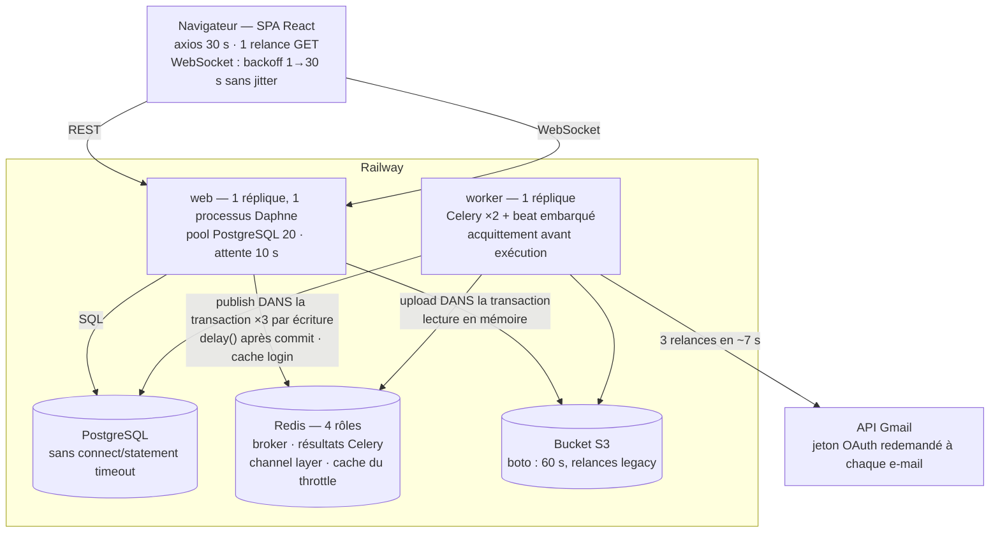
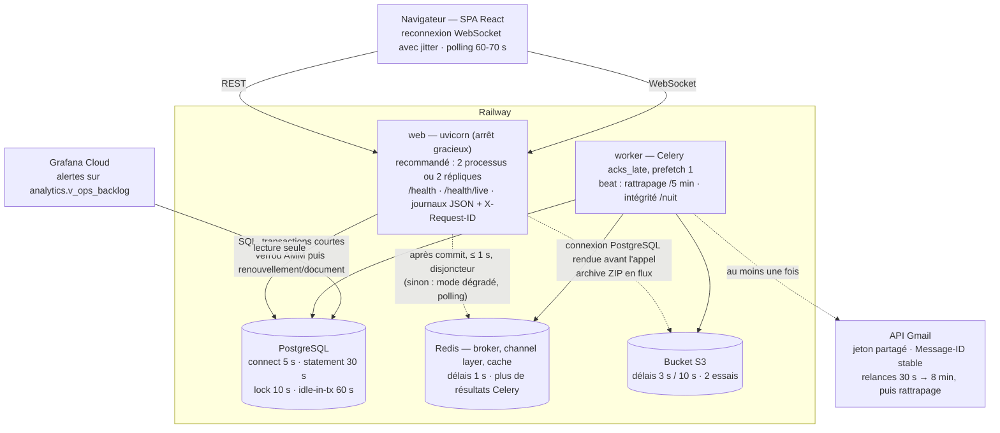

# Audit de résilience et campagne de chaos — AMM INNOV

18 septembre 2026 · branche `Alamine/resilience-chaos-audit-d91d74` · code d'origine : commit `6351395`

Cartographie initiale : [01-cartographie.md](01-cartographie.md). Outillage et résultats bruts : [chaos/](../../chaos/).

## Verdict

L'application ne perd pas de données quand une dépendance *tombe franchement* : PostgreSQL tué,
backend tué, stockage coupé, coupures TCP en pleine transaction — dans ces cas les transactions
se sont annulées proprement et les invariants métier sont restés intacts. Elle était en revanche
fragile de trois façons, toutes mesurées :

1. **Une dépendance accessoire lente ou figée faisait tomber le cœur.** Redis ne sert qu'au temps
   réel, au throttle de connexion et à la file des tâches, mais chaque écriture l'attendait dans sa
   transaction : Redis figé, les écritures prenaient 25 s, tenaient leur connexion du pool et, à
   40 utilisateurs, les *lectures* échouaient à leur tour. Même mécanique avec le stockage S3 et
   les téléchargements. Redis coupé : plus personne ne pouvait se connecter.
2. **Le travail asynchrone se perdait en silence.** Worker tué : e-mails d'alerte perdus, analyse
   de dossier bloquée « en cours » à vie, relance refusée. API Gmail en panne plus de 7 secondes :
   alertes réglementaires jamais envoyées, sans trace ni alerte.
3. **Les écritures concurrentes et partielles n'étaient pas protégées.** Mises à jour perdues,
   huit « versions courantes » d'un même scan, dix renouvellements identiques pour un double envoi,
   et — disque plein — **10 AMM modifiées sans entrée d'historique d'audit**.

S'y ajoutent deux pannes d'infrastructure sans reprise automatique dans la variante serveur
unique (`docker-compose.prod.yml`) : nginx qui vise une IP périmée du backend après un
redémarrage, et nginx qui refuse de démarrer quand Grafana est absent ; et un backend qui, sur
SIGTERM, cessait d'écouter sans jamais se terminer.

Les corrections restent volontairement simples (délais bornés, un disjoncteur, verrous de ligne,
un balayeur de rattrapage, résolution DNS dynamique) : aucune brique d'infrastructure nouvelle.
Résultats avant/après à la section [Crash tests](#crash-tests-réalisés).

## Méthode et laboratoire

- **Environnement** : pile Docker jetable `amm-lab` ([chaos/docker-compose.lab.yml](../../chaos/docker-compose.lab.yml)),
  isolée de toute autre pile (projet, réseau, volumes et ports propres). Reproduit la topologie
  Railway : un processus web, worker avec beat embarqué, stockage S3 (MinIO), e-mails par l'API
  Gmail (faux service pilotable). Chaque dépendance passe par **toxiproxy** (latence, coupure,
  perte, connexions figées). Aucun test n'a touché une production.
- **Données** : 1 600 AMM sur 15 pays (le classeur de production en compte 1 548), 860
  renouvellements, 394 scans, 783 alertes, 47 comptes. État de référence sauvegardé
  (`pg_dump` + archive MinIO) et **restauré avant chaque scénario**.
- **Mesure** : trafic « utilisateurs » continu pendant chaque panne (10 à 40 utilisateurs,
  lectures, écritures, tableau de bord, alertes), sondes métier (connexion, upload, décision de
  renouvellement), ressources des conteneurs, connexions PostgreSQL ; k6 pour la charge.
- **Intégrité** : `manage.py check_integrity` (12 invariants, lecture seule) après **chaque**
  scénario — il est livré avec l'application et tourne désormais chaque nuit.
- **Avant / après à l'identique** : le code d'origine a été figé ([chaos/frozen-avant-backend](../../chaos/),
  image Daphne d'origine, nginx d'origine) ; chaque scénario choisit le code selon son étiquette
  (`--label avant|apres`). Même script, même données, même injection.

Limites de mesure : Docker Desktop sur macOS (18 cœurs, 7,7 Go) ; une autre pile Docker tournait
en parallèle (charge relevée pendant les tests de charge, `others_cpu` ≈ 1 cœur au pic) ; durées
de test de 40 à 60 s par palier. Les chiffres de capacité valent pour ce poste, pas pour Railway.

Deux défauts de **mon outillage** ont été trouvés et corrigés en cours de campagne, et sont
signalés par transparence : le vérificateur d'intégrité ignorait les fourches de versions (un tri
imposé par le manager entrait dans le `GROUP BY`) ; et un premier essai « disque plein » a écrit
92,7 Go sur le disque de la VM Docker (surcouche tmpfs défaite par une restauration) — fichier
supprimé immédiatement, disque jamais au-delà de 15 %, garde-fou ajouté (refus au-delà de 2 Go).

## Architecture initiale



Variante serveur unique (`docker-compose.prod.yml`) : Caddy → nginx (upstreams `backend:8000` et
`grafana:3000` résolus **une fois au démarrage**) → backend uvicorn ×2 ; Redis AOF ; sauvegarde
`pg_dump` quotidienne sur le même disque que la base.

## Points uniques de défaillance

| SPOF | Portée mesurée d'une panne | Reprise |
|---|---|---|
| Processus web unique (Railway) | tout : 241 erreurs 502 sur 4 crashs (s01), 20 utilisateurs touchés | automatique, ~2 s par crash |
| PostgreSQL unique | tout, y compris la sonde de santé (s02a) | automatique ~6 s après son retour |
| Redis (4 rôles) | connexion impossible, écritures ×10 à ×1 000 plus lentes, cascade vers les lectures sous charge (s03, s04) | automatique au retour |
| Worker unique portant beat | e-mails, aperçus, analyses, **jobs nocturnes** ; tâches en vol perdues (s12b) | partielle : file conservée, tâches en vol perdues |
| nginx (serveur unique) | tout, si Grafana absent au démarrage (s11c) ou si le backend change d'IP (s16) | **aucune** : intervention manuelle |
| Disque unique (serveur unique) | écritures en échec à 100 %, historique d'audit troué (s09) ; sauvegardes sur le même disque | aucune détection avant 100 % |

## Goulots d'étranglement mesurés

| Rang | Composant | Mesure (code d'origine) |
|---|---|---|
| 1 | **CPU du processus web unique** | saturé dès ~100 utilisateurs (88 % CPU) ; débit maximal **124 req/s** à 250 utilisateurs, puis recul (111 req/s à 500, 102 req/s à 1 000) ; médiane 915 ms à 250, 8,5 s à 1 000 (s05) |
| 2 | Pool PostgreSQL (20 / processus) | jamais saturé par la charge seule (23 connexions au pic) ; saturé dès qu'une dépendance ralentit les requêtes : 62 échecs sur 300 requêtes simultanées avec PostgreSQL à +200 ms, pool déjà ouvert (s02e) ; épuisé par Redis figé (s03c) ou S3 en panne (s10c) |
| 3 | Emplacements du worker (2) | Gmail lent : aperçus et analyses retardés de 38 s (s13) |
| — | PostgreSQL | jamais le goulot : ≤ 35 % CPU sous charge ; la requête la plus coûteuse (liste d'AMM, `DISTINCT`) cumule < 1 s de SQL par minute ; aucun N+1 sur les 12 endpoints mesurés (s14) |
| — | Mémoire du web | croît avec la concurrence (117 → 257 Mio de 10 à 1 000 utilisateurs) ; un seul mode de défaillance : archives ZIP (s08) |

## Crash tests réalisés

Chaque ligne est un scénario de [chaos/scenarios.py](../../chaos/scenarios.py), joué deux fois
à l'identique : sur le code d'origine figé (`--label avant`) puis sur le code corrigé
(`--label apres`). Les valeurs sont lues dans `chaos/results/*.json` par
`python3 chaos/build_report.py --markdown docs/audit-resilience/RAPPORT.md` ; aucune n'est
recopiée à la main.

- **SUCCESS** : pendant la panne, tout ce qui ne dépend pas du composant en panne fonctionne ; ce
  qui en dépend échoue vite, avec un message explicite ; la reprise est automatique ; aucun
  invariant n'est rompu. Les requêtes coupées par l'injection elle-même (connexion TCP tuée en
  vol) ne comptent pas contre le verdict si elles échouent proprement et sans trace en base.
- **PARTIAL** : indisponibilité inhérente à la panne (sans base, pas d'application), ou
  dégradation bornée, mais reprise automatique et aucune donnée perdue.
- **FAILURE** : donnée perdue ou incohérente, cascade vers des fonctions qui ne dépendent pas du
  composant en panne, ou aucune reprise automatique.

<!-- auto:matrice -->
| Domaine | Test | Panne injectée | Avant | Mesure avant | Après | Mesure après |
|---|---|---|---|---|---|---|
| Redis | s03a | Redis tué 60 s | **FAILURE** | connexions 0/13 · écritures p95 15.1 s · uploads 0/1 (max 60.0 s), 1 fantôme(s) | **SUCCESS** | connexions 21/21 · écritures p95 37 ms · uploads 14/14 (max 9.1 s) |
| Redis | s03b | Redis figé 60 s | **FAILURE** | connexions 0/12 · écritures p95 25.1 s · uploads 1/1 (max 59.0 s) | **SUCCESS** | connexions 20/20 · écritures p95 36 ms · uploads 14/14 (max 9.2 s) |
| Redis | s03c | Redis figé 60 s sous 40 utilisateurs | **FAILURE** | lectures 18/381 en échec, p95 10.0 s · écritures p95 25.0 s · 19 utilisateur(s) touché(s) | **SUCCESS** | lectures 0/3613 en échec, p95 67 ms · écritures p95 110 ms · 0 utilisateur(s) touché(s) |
| Redis | s04 | Latence Redis 1 s | **PARTIAL** | écritures p95 6.1 s · connexions 5/5 | **SUCCESS** | écritures p95 971 ms · connexions 13/13 |
| Redis | s04 | Latence Redis 3 s | **FAILURE** | écritures p95 21.2 s · connexions 2/2 | **SUCCESS** | écritures p95 54 ms · connexions 14/14 |
| PostgreSQL | s02a | PostgreSQL tué 30 s | **PARTIAL** | 25/25 requêtes en échec · lectures 21/21 en échec, p95 10.0 s · reprise 5.8 s | **PARTIAL** | 26/26 requêtes en échec · lectures 23/23 en échec, p95 10.0 s · reprise 2.2 s |
| PostgreSQL | s02f | Redémarrage rapide de PostgreSQL | **SUCCESS** | 6/88 requêtes en échec · reprise 0.1 s | **SUCCESS** | 5/34 requêtes en échec · reprise 0.0 s |
| PostgreSQL | s02b | PostgreSQL figé 60 s | **PARTIAL** | lectures 31/31 en échec, p95 30.0 s · décisions 1/2 · reprise 0.3 s | **PARTIAL** | lectures 28/28 en échec, p95 30.0 s · décisions 1/2 · reprise 0.1 s |
| PostgreSQL | s02c | Latence PostgreSQL 1 s | **PARTIAL** | lectures 0/63 en échec, p95 4.0 s · écritures p95 15.6 s | **PARTIAL** | lectures 0/58 en échec, p95 4.1 s · écritures p95 16.1 s |
| PostgreSQL | s02d | Coupures TCP en pleine transaction | **PARTIAL** | 368/2276 requêtes en échec · reprise 1.0 s | **SUCCESS** | 386/2265 requêtes en échec · reprise 0.7 s |
| PostgreSQL | s02e | Pool saturé (300 requêtes lentes, pool chaud) | **FAILURE** | 300 requêtes : 238 × 200, 62 × 500 (HTML) · médiane 8.28 s | **PARTIAL** | 300 requêtes : 224 × 200, 76 × 503 (JSON) · médiane 7.96 s |
| Processus | s01 | Web tué (SIGKILL) ×4 | **PARTIAL** | 241/2503 requêtes en échec · 20 utilisateur(s) touché(s) · reprise 0.7 s | **PARTIAL** | 227/2468 requêtes en échec · 20 utilisateur(s) touché(s) · reprise 0.2 s |
| Processus | s11a | Web arrêté (SIGTERM) en charge | **FAILURE** | requêtes en vol : 2 × 200, 18 × 502 · processus vivant mais sourd, jamais redémarré | **SUCCESS** | requêtes en vol : 15 × 200, 5 × 503 · de retour en 17.7 s |
| Processus | s11b | Web tué (SIGKILL) en charge | **PARTIAL** | requêtes en vol : 2 × 200, 18 × 502 · de retour en 2.6 s | **PARTIAL** | requêtes en vol : 20 × 502 · de retour en 2.5 s |
| Processus | s11c | nginx redémarré, Grafana absent | **FAILURE** | API injoignable (statut 0) : nginx refuse de démarrer | **SUCCESS** | API joignable (200) avec Grafana arrêté |
| Processus | s16 | Redémarrage complet, base tardive | **FAILURE** | démarrage à froid 18.5 s · base tardive : backend sain en direct (2.3 s) mais injoignable via nginx (IP 172.26.0.8 → 172.26.0.7) | **SUCCESS** | démarrage à froid 18.2 s · base tardive : API de retour 4.4 s après la base |
| Stockage | s10a | MinIO arrêté 60 s | **PARTIAL** | lectures 0/915 en échec, p95 29 ms · uploads 1/7 (max 17.5 s) | **SUCCESS** | lectures 0/903 en échec, p95 39 ms · uploads 0/13 (max 12.2 s) |
| Stockage | s10b | MinIO figé 60 s | **PARTIAL** | lectures 0/2777 en échec, p95 57 ms · uploads 1/1 (max 59.4 s) | **PARTIAL** | lectures 0/2775 en échec, p95 38 ms · uploads 0/2 (max 30.7 s) |
| Stockage | s10c | 20 téléchargements, MinIO arrêté | **FAILURE** | téléchargements : 20 × 500 (max 27.1 s) · listes d'AMM sans rapport pendant ce temps : 4 × 200, 1 × 500 | **SUCCESS** | téléchargements : 20 × 503 (max 17.9 s) · listes d'AMM sans rapport pendant ce temps : 5 × 200 |
| Tâches | s12a | Worker arrêté 60 s | **SUCCESS** | 31 tâches en file · vidée en 6.6 s · e-mails 20/20, reçus 20 | **SUCCESS** | 31 tâches en file · vidée en 6.6 s · e-mails 20/20, reçus 20 |
| Tâches | s12b | Worker tué en pleine tâche | **FAILURE** | e-mails 0/6 envoyés · dossier après relance : RUNNING (relance 409) | **SUCCESS** | e-mails 6/6 envoyés · dossier après relance : READY (relance 202) |
| Tâches | s11d | Worker arrêté pendant des envois lents | **FAILURE** | arrêt en 3.3 s · e-mails 0/4 envoyés, 0 reçus par Gmail | **SUCCESS** | arrêt en 0.1 s · e-mails 4/4 envoyés, 4 reçus par Gmail |
| Tâches | s11e | Redis tué avec 200 tâches en file | **SUCCESS** | file : 200 avant SIGKILL, 200 après (Redis AOF) | **SUCCESS** | file : 200 avant SIGKILL, 200 après (Redis AOF) |
| Externe | s13 | API Gmail : 500, 429, invalide, lente, figée, coupée | **FAILURE** | e-mails finalement envoyés : 10/40 (panne de 3 min : 0/5) · accusé perdu : 20 envois pour 5 e-mails · aperçus retardés 37.8 s | **PARTIAL** | e-mails finalement envoyés : 40/40 (panne de 3 min : 5/5) · accusé perdu : 21 envois pour 5 e-mails · aperçus retardés 28.0 s |
| Données | s15 | Écritures concurrentes sur une même ressource | **FAILURE** | même décision ×10 → 10 renouvellement(s) · mise à jour perdue : oui (52 régressions) · remplacements ×8 → 8 version(s) courante(s) | **SUCCESS** | même décision ×10 → 1 renouvellement(s) · mise à jour perdue : non (0 régressions) · remplacements ×8 → 1 version(s) courante(s) |
| Données | s09 | Disque plein (80 → 100 %) | **FAILURE** | base à 80/90/95 % : aucune alerte · base à 100 % : 118/501 en échec, santé 200 · intégrité : history_matches_rows ×10 | **PARTIAL** | base à 80/90/95 % : aucune alerte · base à 100 % : 126/490 en échec, santé 200 · intégrité OK |
| Charge | s05 | Paliers 10 → 1 000 utilisateurs | **PARTIAL** | plafond 123.9 req/s à 250 utilisateurs · 1 000 utilisateurs : médiane 8.5 s, erreurs 0.0 | **PARTIAL** | plafond 151.5 req/s à 250 utilisateurs · 1 000 utilisateurs : médiane 7.5 s, erreurs 0.0 |
| Charge | s06 | Pic 10 → 1 000 en 5 s | **PARTIAL** | 70.0 req/s · médiane 8.1 s · p99 9.4 s · erreurs 0.0 | **PARTIAL** | 75.6 req/s · médiane 7.6 s · p99 8.1 s · erreurs 0.0 |
| Ressources | s07 | CPU bridé à 0,15 cœur (web) | **SUCCESS** | 0/342 requêtes en échec · médiane 1.2 s | **SUCCESS** | 0/332 requêtes en échec · médiane 1.2 s |
| Ressources | s08 | 8 archives ZIP de scans lourds | **FAILURE** | 8 archives : 8 × 502 · redémarrages du web 1 · autres utilisateurs : 22 erreur(s) · mémoire web jusqu'à 872 Mio (relevé toutes les 3 s) | **SUCCESS** | 8 archives : 8 × 200 · redémarrages du web 0 · autres utilisateurs : 0 erreur(s) · mémoire web jusqu'à 350 Mio (relevé toutes les 3 s) |
| Réseau | s04b | Réseau instable (jitter, paquets, pertes) | **PARTIAL** | 0/82 requêtes en échec · lectures 0/67 en échec, p95 16.2 s · connexions 13/18 | **PARTIAL** | 0/75 requêtes en échec · lectures 0/60 en échec, p95 16.8 s · connexions 20/20 |
| Réseau | s04c | Partition réseau 30 s | **PARTIAL** | 1/2 requêtes en échec · reprise 1.5 s | **PARTIAL** | 3/3 requêtes en échec · reprise 0.7 s |
| Temps réel | s17 | Web tué, 300 clients WebSocket | **PARTIAL** | pic 300 reconnexions/s (671 au total) | **PARTIAL** | pic 255 reconnexions/s (607 au total) |
| Temps réel | s18 | 20 écritures, 100 clients connectés | **PARTIAL** | 4830 événements pour 20 écritures (2.42 par client et par écriture) | **SUCCESS** | 635 événements pour 20 écritures (0.32 par client et par écriture) |
| Combinées | p3a | 40 utilisateurs + Redis tué + PostgreSQL lent | **FAILURE** | connexions 1/19 · écritures p95 12.3 s · uploads 1/3 (max 31.8 s), 2 fantôme(s) | **PARTIAL** | connexions 20/20 · écritures p95 6.7 s · uploads 12/12 (max 12.4 s) |
| Combinées | p3b | Web tué + worker arrêté + Gmail en panne | **FAILURE** | API : 33 erreur(s) · e-mails 0/10 après retour de Gmail · reçus 0 | **PARTIAL** | API : 28 erreur(s) · e-mails 7/10 après retour de Gmail · reçus 7 |
| Combinées | p3c | CPU web bridé + PostgreSQL lent + pic à 500 | **PARTIAL** | 34.3 req/s · médiane 8.8 s · p99 10.2 s · erreurs 0.0 | **PARTIAL** | 36.8 req/s · médiane 7.7 s · p99 9.5 s · erreurs 0.0 |
<!-- /auto -->

Pourquoi des **PARTIAL** restent après correction, et ce qui a été décidé :

| Test | Ce qui reste | Décision |
|---|---|---|
| s02a, s02b | sans PostgreSQL, rien ne marche ; base figée : les requêtes déjà envoyées attendent le délai du client (30 s) — `statement_timeout` est appliqué par le serveur, qui ne répond plus | inhérent ; `/health` répond 503 en 2 s pour qu'une sonde externe alerte |
| s02c | base lente : chaque écriture paie chacune de ses requêtes SQL, et elles sont **plus lentes après correction** — p95 1,6 → 2,0 s à +100 ms par aller-retour, 6,5 → 11,8 s à +500 ms, 15,6 → 16,1 s à +1 s. Cause probable : le verrou d'AMM ajoute un aller-retour et fait attendre les écritures simultanées sur une même fiche | accepté : c'est le prix de la suppression des mises à jour perdues (I4) ; sans latence injectée, les écritures restent sous 100 ms au p95 jusqu'à 100 utilisateurs (s05) |
| s02e | pool saturé : les requêtes en trop attendent 10 s puis reçoivent un 503 JSON. Après correction, un peu plus de requêtes échouent (voir I14) | accepté ; la capacité se règle par le nombre de processus |
| s01, s11b | processus web tué : les requêtes en vol sont perdues (502), le client relance une fois ses lectures. Deux processus dans le même conteneur n'y changent rien (s01 rejoué avec `WEB_CONCURRENCY=2` : 276 requêtes en échec, contre 227) : le crash emporte le conteneur entier | 2 répliques Railway (deux conteneurs) — recommandé, **non mesuré** dans le laboratoire |
| s10b | stockage figé : l'upload échoue proprement en ≈ 30 s (au lieu de 60 s) ; les lectures ne sont plus touchées | accepté ; descendre sous 30 s demanderait de renoncer à la relance S3 |
| s04b, s04c | réseau instable ou coupé : les requêtes attendent, ou échouent pendant la coupure ; rien n'est perdu, reprise < 1 s | inhérent |
| s05, s06, p3c | un processus web plafonne ; au-delà, les réponses ralentissent sans erreur | configuration : 2 processus (mesuré ci-dessous) |
| s17 | 300 clients WebSocket se reconnectent toutes les 30 s d'un coup ; le serveur l'absorbe dans les deux cas (tous reconnectés) ; le jitter réduit le pic de 15 % seulement | suffisant à ce volume ; pas d'autre changement |
| s13 | tous les e-mails finissent par partir, mais en double quand Gmail accepte un message sans répondre à temps (21 envois pour 5 e-mails, 11 pour 5 si Gmail met 30 s) | assumé : « au moins une fois » (I8) |
| s09 | aucune alerte avant 100 % de disque ; à 100 %, les écritures échouent (sans données incohérentes désormais) | surveillance disque recommandée sur la variante serveur unique |
| p3a, p3b | pannes combinées : écritures lentes (PostgreSQL lent) ; e-mails différés jusqu'au passage suivant du rattrapage | attendu |

## Incidents critiques et corrections

Gravité : **CRITIQUE** = perte ou corruption de données, ou panne totale sans reprise ;
**MAJEUR** = fonction essentielle indisponible ou dégradée au-delà de l'usage ;
**MINEUR** = inconfort ou coût, sans perte.

Chaque fiche donne le problème et sa gravité (titre), le scénario qui le reproduit, l'impact
mesuré avant correction, la cause racine, la correction — minimale puis architecturale quand
elles diffèrent —, la mesure après correction sur le même scénario, et les tests automatisés qui
empêchent le retour du défaut (`backend/tests/test_resilience_*.py`).

### I1 — Redis lent ou figé fait tomber toute l'API · CRITIQUE

- **Reproduction** : `python3 chaos/scenarios.py s03c_redis_hang_load` (Redis figé 60 s, 40 utilisateurs) ; `s04_redis_latency` (100 ms → 3 s).
- **Mesure avant** : écritures p95 25 s ; lectures en échec (18/381 en 500, jusqu'à 10 s d'attente) ;
  19 utilisateurs touchés. Latence Redis de 100 ms ⇒ écritures à 1 s ; 3 s ⇒ écritures à 21 s, connexion à 24 s.
- **Cause racine** : trois `group_send` Redis par écriture d'AMM, exécutés dans les signaux
  `post_save`, donc **dans la transaction et avec la connexion du pool tenue** ; aucun délai
  explicite (redis-py attend 5 s par défaut). Les écritures bloquées épuisaient le pool (20) et
  les lectures attendaient leur tour jusqu'au `PoolTimeout`.
- **Correction minimale** : délais bornés sur tous les clients Redis (`REDIS_*_TIMEOUT`).
- **Correction architecturale** : la publication temps réel part **après le commit**, bornée à
  1 s, derrière un **disjoncteur** (`apps/core/resilience.py` : un pour le temps réel et le
  cache, un autre pour la file des tâches, pour qu'une lenteur de l'un ne coupe pas l'autre) ; événements d'AMM envoyés
  au seul groupe du pays. Le temps réel devient un confort : sans Redis, les clients retombent
  sur leur polling de 60 s.
- **Après** (même scénario) : lectures 0/3 613 en échec, p95 67 ms ; écritures p95 110 ms ; 0
  utilisateur touché. Latence Redis de 3 s ⇒ écritures p95 54 ms (le disjoncteur s'ouvre au
  premier délai dépassé) ; 100 ms ⇒ 426 ms ; 1 s ⇒ 971 ms.
- **Tests** : `test_publish_waits_for_commit`, `test_publish_is_bounded_when_redis_hangs`,
  `test_breaker_skips_redis_after_a_failure`, `test_amm_write_is_fast_when_realtime_is_down`.

### I2 — Redis coupé : plus personne ne peut se connecter · CRITIQUE

- **Reproduction** : `s03a_redis_kill`. **Avant** : 0 connexion réussie sur 13 (500 après 5 s).
- **Cause racine** : les throttles anti force brute (`LoginThrottle`, `LoginEmailThrottle`)
  lisent et écrivent le cache Redis sans repli ; toute exception devient un 500.
- **Correction** : `ResilientCache` — Redis, et mémoire locale du processus quand le disjoncteur
  est ouvert. La protection anti force brute reste active (par processus au lieu de globale).
- **Après** : 21/21 connexions réussies pendant les 60 s de panne, en 0,19 s au plus.
- **Tests** : `test_login_works_when_the_cache_is_unavailable`, `test_login_throttle_still_applies_in_fallback`.

### I3 — Upload enregistré mais annoncé en échec (écritures fantômes) · MAJEUR

- **Reproduction** : `s03a_redis_kill`, `p3a_load_redis_down_pg_slow`. **Avant** : upload bloqué
  plus de 60 s puis abandonné par le client alors que le scan était en base ; 2 uploads « 500 mais
  enregistrés » en panne combinée. L'utilisateur renvoie le fichier et reçoit « doublon ».
- **Cause racine** : `task.delay()` appelée dans `on_commit` sans protection ; le backend de
  résultats Celery (inutilisé) abonnait chaque processus web au pub/sub Redis — Redis figé,
  `delay()` ne rendait jamais la main (> 130 s mesurés) ; Redis coupé, 12 à 19 s.
- **Correction** : `enqueue()` ne lève plus jamais après commit ; backend de résultats supprimé
  (`CELERY_TASK_IGNORE_RESULT`) ; une seule relance de publication. La tâche non publiée est
  rattrapée par `recover_pending_work` (voir I6).
- **Après** : Redis coupé, 14/14 uploads réussis et aucun fantôme (s03a) ; en pannes combinées,
  12/12 et aucun fantôme (p3a). Le plus lent attend 9,1 s : quand le disjoncteur du broker est
  fermé ou à l'essai (toutes les 15 s), une requête paie une tentative de publication bornée.
- **Test** : `test_enqueue_failure_does_not_fail_a_committed_upload`, `test_celery_results_are_not_stored_in_redis`.

### I4 — Mise à jour perdue et modification sans trace d'audit · CRITIQUE

- **Reproduction** : `s15_concurrency` (c) — deux éditeurs sur deux champs d'une même AMM ;
  `s09_disk_full` (base pleine). **Avant** : valeur finale fausse et 52 régressions de valeurs
  dans l'historique ; disque plein : **10 AMM modifiées sans entrée d'historique**.
- **Cause racine** : `PATCH /amms/{id}` (ModelViewSet) en autocommit : l'UPDATE, l'INSERT
  d'historique (django-simple-history) et la réconciliation des alertes étaient trois
  transactions ; et chaque requête relisait la ligne sans verrou puis réécrivait tous ses champs.
- **Correction** : `update()` atomique, ligne AMM verrouillée (`select_for_update`) avant d'être
  relue ; même traitement pour `PATCH /renewals/{id}`.
- **Après** : valeur finale juste, 0 régression dans l'historique (s15c) ; disque plein : 0 AMM
  sans historique, intégrité OK (s09).
- **Tests** : `test_amm_patch_is_all_or_nothing`, `test_concurrent_patches_do_not_lose_updates`.

### I5 — Plusieurs versions « courantes » d'un même scan · MAJEUR

- **Reproduction** : `s15_concurrency` (e). **Avant** : 8 remplacements simultanés ⇒ 8 × 201 et
  8 successeurs courants.
- **Cause racine** : `replace` vérifiait `is_current` sans verrou.
- **Correction** : la version remplacée est verrouillée et relue dans `ingest_document` ; ordre
  de verrouillage AMM → document.
- **Après** : 8 remplacements simultanés ⇒ 1 version courante ; les autres reçoivent un message
  « Ce document vient d'être remplacé : rechargez la page, puis réessayez. »
- **Test** : `test_concurrent_replaces_leave_one_current_version`.

### I6 — Worker tué : tâches perdues, dossier bloqué à vie · CRITIQUE

- **Reproduction** : `s12b_worker_kill_mid_task`, `s11d_worker_sigterm_long_task`.
  **Avant** : 0/6 e-mails partis, 5 messages « non acquittés » en attente du
  `visibility_timeout` (1 h), analyse de dossier `RUNNING` à vie et relance refusée (409) ; arrêt
  propre du worker pendant des envois lents : 0/4 e-mails partis.
- **Cause racine** : acquittement **avant** exécution (défaut Celery) ; aucune reprise de ce que
  la base déclare « à faire » ; claim `PENDING → RUNNING` sans date, donc sans expiration.
- **Correction** : `acks_late` + `reject_on_worker_lost` + `prefetch 1` ; balayeur
  `recover_pending_work` toutes les 5 min (e-mails non partis, analyses orphelines passées en
  « interrompue, relancez », analyses en attente republiées, aperçus manquants) ;
  `DossierImport.started_at` ; claim atomique de `run_import`.
- **Après** : 5/6 e-mails partis dans les 90 s qui suivent le redémarrage du worker ; le 6ᵉ
  (message resté « non acquitté » dans Redis) part au passage du rattrapage, déclenché dans le
  test après avoir vieilli les lignes au lieu d'attendre 15 min ; ce même passage marque l'analyse
  « interrompue », sa relance est acceptée (202) et aboutit (`READY`) en 3,2 s. Arrêt propre
  pendant des envois lents : 4/4.
- **Tests** : `test_sweeper_*`, `test_analysis_claim_records_start_time`, `test_celery_tasks_survive_a_worker_crash`.

### I7 — Alertes réglementaires perdues quand Gmail flanche · CRITIQUE

- **Reproduction** : `s13_gmail_failures`. **Avant** : Gmail en 500, 429, réponse invalide ou
  connexion coupée pendant 60 s ⇒ **0/5 e-mails envoyés**, même après le retour de Gmail ; panne
  de 3 minutes ⇒ 0/5.
- **Cause racine** : 3 relances en ~7 s puis abandon définitif, sans trace (`sent_at` vide, rien
  d'autre) ni reprise.
- **Correction** : relances 30 s → 8 min (~15 min), puis balayeur toutes les 15 min jusqu'à 60
  tentatives (~5 h, par exemple un quota journalier dépassé) ; `send_attempts`,
  `last_attempt_at`, `last_error` sur la notification ; vue `analytics.v_ops_backlog` pour Grafana.
- **Après** : pendant chaque panne de 60 s, une partie des e-mails part déjà grâce aux relances
  espacées ; puis, Gmail rétabli et un passage du rattrapage (les lignes sont vieillies de 30 min
  dans le test au lieu d'attendre), **40/40 e-mails envoyés**, dont 5/5 pour la panne de 3 min ;
  même scénario sur le code d'origine : 10/40, et 0/5 pour la panne de 3 min.
- **Tests** : `test_failed_send_is_recorded_on_the_notification`, `test_email_retries_span_a_long_outage`.

### I8 — E-mails en double quand la réponse de Gmail se perd · MINEUR (assumé)

- **Reproduction** : `s13_gmail_failures`, mode `ack_lost` (Gmail accepte le message puis la
  réponse se perd) et mode `slow` (Gmail répond en 30 s). **Avant** : `ack_lost` ⇒ 20 envois
  pour 5 e-mails, et aucun marqué envoyé.
- **Après** : `ack_lost` ⇒ 21 envois pour 5 e-mails ; `slow` ⇒ 11 envois pour 5 e-mails (le
  délai client de 10 s expire alors que Gmail a accepté). Le code d'origine n'avait pas de
  doublon en mode `slow` pour une mauvaise raison : il redemandait le jeton OAuth à chaque
  envoi, ce jeton expirait lui aussi, et rien ne partait avant le retour de Gmail.
- **Arbitrage** : l'API Gmail n'offre pas de clé d'idempotence ; le choix « au moins une fois »
  est assumé (une alerte J-30 en double vaut mieux qu'une alerte perdue). Atténuation : un
  `Message-ID` stable par notification, sur lequel Gmail s'appuie pour écarter les doublons à
  la réception — comportement non vérifiable dans le laboratoire, le faux service ne le
  reproduit pas. Écarté : relire les messages envoyés avant chaque relance (droit de lecture
  de la boîte, complexité) pour un doublon occasionnel.
- **Test** : `test_retried_email_keeps_the_same_message_id`.

### I9 — Décision enregistrée deux fois · MAJEUR

- **Reproduction** : `s15_concurrency` (a), `s02b_pg_hang`. **Avant** : la même décision envoyée
  10 fois ⇒ 10 renouvellements ; une décision « échouée » côté client (délai dépassé) était
  enregistrée au dégel de la base, et l'utilisateur la ressaisissait.
- **Correction** : idempotence par clé naturelle (n° + date de début) sous le verrou de l'AMM ;
  la même décision renvoie `200` et le renouvellement existant.
- **Après** : 10 envois ⇒ 1 renouvellement (s15a) ; base figée : la décision en délai dépassé
  n'est plus enregistrée au dégel (s02b : 0 écriture fantôme), et la renvoyer est sans risque.
- **Tests** : `test_same_decision_twice_creates_one_renewal`, `test_same_decision_sent_concurrently_creates_one_renewal`.

### I10 — nginx : API coupée par Grafana absent ou IP périmée du backend · CRITIQUE (serveur unique)

- **Reproduction** : `s11c_nginx_restart_without_grafana` ; `s16_full_restart` (base absente au
  démarrage du web). **Avant** : `host not found in upstream "grafana:3000"`, API injoignable ;
  backend passé de `172.26.0.8` à `172.26.0.7` après redémarrage, sain en direct (200 en 2,3 s) mais
  **injoignable via nginx pendant les 240 s d'observation et jusqu'à redémarrage manuel**.
- **Cause racine** : upstreams nginx résolus une seule fois au démarrage.
- **Correction** : `resolver 127.0.0.11` + `server … resolve` (nginx ≥ 1.27.3) ;
  l'entrypoint retente `migrate` sur place au lieu de sortir (8 redémarrages en 90 s mesurés).
- **Après** : API joignable (200) avec Grafana arrêté ; base tardive : API de retour 4,4 s après
  la base, sans intervention.
- **Test** : rejeu des scénarios s11c et s16.

### I11 — SIGTERM : backend vivant mais sourd · CRITIQUE

- **Reproduction** : `s11a_backend_sigterm`. **Avant** : 18/20 requêtes en vol en 502, puis
  processus Daphne toujours présent, port fermé, conteneur « running » : aucun redémarrage en
  120 s. (SIGKILL, lui, redémarre en 2,6 s.)
- **Correction** : uvicorn aussi pour un seul processus (déjà utilisé en production au-delà de
  1) avec `--timeout-graceful-shutdown` : drainage puis sortie.
- **Après** : 15 requêtes en vol terminées (200), 5 refusées proprement (503), service de retour
  en 17,7 s.
- **Test** : rejeu de s11a.

### I12 — Stockage S3 en panne : le pool PostgreSQL s'épuise · MAJEUR

- **Reproduction** : `s10c_storage_downloads`. **Avant** : 20 téléchargements ⇒ 20 × 500 après
  jusqu'à 27 s, **et une liste d'AMM sans rapport en 500 (10 s)**.
- **Cause racine** : la connexion PostgreSQL restait tenue pendant la lecture S3 ; boto attendait
  60 s par appel avec relances ; réponse lue entièrement en mémoire (django-storages, `max_memory_size=0`).
- **Correction** : connexion rendue au pool avant la lecture comme avant l'écriture S3 ; l'upload
  n'est plus une transaction englobante (le rejeu a montré qu'une transaction ouverte pendant
  un appel S3 figé se faisait couper par `idle_in_transaction_session_timeout`) ; erreurs de
  stockage en 503 propre ; délais S3 (3 s / 10 s, 2 essais) ; fichier au-delà de 5 Mo sur disque.
- **Après** : 20 × 503 au lieu de 500 (message « stockage momentanément indisponible »), le plus
  lent en 17,9 s ; pendant ce temps, les listes d'AMM sans rapport restent à 200 en ≤ 0,25 s.

### I13 — Archive ZIP : le processus web meurt de mémoire · MAJEUR

- **Reproduction** : `s08_memory`. **Avant** : 8 archives de 12 scans de 20 Mo ⇒ mémoire 659 →
  872 Mio puis mort du processus, 8 × 502 et **22 requêtes d'autres utilisateurs en échec**.
- **Cause racine** : ZIP assemblé en mémoire, chaque scan lu d'un bloc.
- **Correction** : archive **produite au fil de l'eau**, bloc par bloc, sans recompression, et
  servie par un itérateur **asynchrone** sous ASGI (`aiter_blocks`). Il a fallu trois essais, tous
  mesurés par le rejeu de s08 :
  1. ZIP écrit dans un fichier temporaire : processus tué à nouveau — le cache disque est compté
     dans la mémoire du conteneur (pic au plafond de 1 Go dans un conteneur isolé de même limite).
  2. `StreamingHttpResponse` sur un générateur synchrone : 15 Mo quand le générateur est lu
     directement, mais **processus tué à nouveau dans le laboratoire** (8 échecs, 20 requêtes
     d'autres utilisateurs en 502, 443 Mio au premier relevé). Cause : sous ASGI, Django 5.2
     lit un itérateur synchrone en entier (`sync_to_async(list)`) avant d'envoyer le premier octet.
  3. Itérateur asynchrone qui tire chaque bloc à la demande et referme le scan ouvert si le
     client s'en va. Rejeu : 8/8 archives servies, mais 641 Mio de mémoire anonyme au pic, et
     755 Mio après trois séries de plus (627 → 705 → 737 → 755) : boto3 télécharge chaque scan
     en parts de 8 Mo sur 10 fils, en mémoire.
  4. Téléchargement S3 séquentiel (`use_threads: False` dans les options du stockage).
- **Après** (essai 4) : 8/8 archives servies en 5,1 à 7,9 s, processus web jamais redémarré,
  0 erreur pour les autres utilisateurs ; 350 Mio au pic, puis 333 Mio stables sur trois séries
  supplémentaires de 8 archives.
- **Tests** : `test_archive_blocks_are_pulled_one_at_a_time`,
  `test_archive_is_streamed_asynchronously_under_asgi` (échoue sur l'essai 2).

### I14 — Pool saturé : page HTML 500 · MINEUR

- **Reproduction** : `s02e_pg_pool_saturation` — 300 requêtes simultanées, PostgreSQL à +200 ms par
  aller-retour, pool réchauffé à l'identique avant la rafale. **Avant** : 238 réussites, 62 × 500
  en page HTML (deux essais identiques).
- **Correction** : 503 JSON avec `Retry-After` pour toute erreur de base (pool, `statement_timeout`,
  `lock_timeout`, base injoignable). **Test** : `test_database_saturation_returns_a_json_503`.
- **Après** : les échecs sont des 503 JSON, mais un peu plus nombreux : 220 et 224 réussites
  (76 et 80 × 503) contre 238, soit ≈ 6 % de moins. Ce n'est ni la requête SQL (identique : 4
  requêtes par liste des deux côtés, `pg_stat_statements`), ni les nouvelles options de connexion,
  ni le middleware de journalisation (essais croisés sans chacun) ; le code corrigé servi par
  Daphne regagne une partie de l'écart (74 contre 68 réussites dans l'essai à froid ci-dessous).
  **Écart non expliqué**, sans conséquence au-delà de ce test de saturation.
- **Mesure faussée d'abord, et corrigée** : la première version du scénario partait d'un pool
  froid. La sonde `/health` d'origine passait par le pool et le gardait ouvert (4 connexions
  avant la rafale), la nouvelle ne l'utilise plus (0) : sur 150 requêtes, 88 à 98 réussites
  avant (quatre essais) contre 68 et 69 après (trois essais). Pool réchauffé de la même façon : 150
  sur 150 des deux côtés — d'où les 300 requêtes de la version actuelle. En production, un
  pool froid ne coûte que quelques millisecondes par connexion à latence normale.

### I15 — Tempête de reconnexions WebSocket et amplification des événements · MINEUR

- **Reproduction** : `s17_ws_reconnect_herd`, `s18_event_amplification`. **Avant** : 300
  tentatives dans la même seconde, deux fois ; 20 écritures ⇒ 4 830 événements (2,4 par client
  et par écriture), chacun déclenchant des rechargements.
- **Correction** : jitter sur la reconnexion et le polling (`reconnectDelay`, `pollInterval`) ;
  événements d'AMM au seul groupe du pays ; plus de `dashboard.refresh` à chaque écriture.
- **Après** : 635 événements pour 20 écritures (0,32 par client et par écriture) ; reconnexions :
  pic de 255 par seconde au lieu de 300 — gain modeste, le serveur absorbant de toute façon les
  300 reconnexions.
- **Tests** : `reconnect.test.ts`, `test_country_user_groups_and_events`.

### Autres corrections, mêmes principes

| Constat | Correction | Test |
|---|---|---|
| Aucun `connect_timeout` / `statement_timeout` / `lock_timeout` / `idle_in_transaction_session_timeout` : base figée ⇒ requêtes jusqu'au délai du client (s02b, s02c) | délais PostgreSQL bornés et réglables | `test_database_calls_are_bounded` |
| Crash entre la création d'une alerte et sa notification ⇒ notification jamais envoyée (H11) | alerte et notifications d'une AMM dans une transaction, e-mails après commit | `test_alert_creation_and_dispatch_are_atomic` |
| Digest hebdomadaire : un échec arrête la tournée, une relance renvoie à tous | un échec n'arrête plus rien ; les utilisateurs déjà servis sont sautés | `test_weekly_digest_survives_one_failure_and_is_not_resent` |
| Purge : fichier supprimé avant la ligne | ligne supprimée, puis fichier après commit | `test_purge_never_leaves_a_row_without_its_file` |
| Fichier S3 orphelin quand la base échoue après l'upload (s02d : 2 orphelins) | suppression du fichier sur échec de l'écriture en base | vérificateur `orphan_blobs` |
| Jeton OAuth Gmail redemandé à chaque e-mail (s12a : 20 appels pour 20 e-mails) | jeton partagé par processus | `test_access_token_is_shared_across_send_mail_calls` |
| Gmail lent : les 2 emplacements du worker bloqués 20 s par appel (aperçus retardés de 38 s) | délai HTTP Gmail 10 s (la tâche est relancée) : aperçus retardés de 28 s. Contrepartie : une réponse de Gmail entre 10 et 20 s donnera désormais un doublon (I8) | rejeu de s13 |
| Balayeur : un PDF illisible serait republié toutes les 5 min (410 tâches par passage) | PDF illisible ⇒ `page_count = 0` ; stockage indisponible ⇒ reprise | `test_unreadable_pdf_is_not_retried_forever` |
| `/health` bloqué quand Redis est figé ; aucune sonde de vivacité | Redis borné à 0,5 s ; `/health/live` sans dépendance | `test_liveness_does_not_touch_dependencies`, `test_readiness_reports_redis_quickly` |

### Relecture des corrections

Une relecture indépendante du diff, puis le rejeu lui-même, ont trouvé **10 défauts dans mes
propres corrections**, tous corrigés et couverts par un test avant la mesure finale :
verrou d'AMM tenu pendant tout l'upload et l'appel S3 ; sonde `/health` ignorant `sslmode` (elle
aurait bloqué les déploiements sur une base TLS) ; migrations soumises aux nouveaux
`statement_timeout`/`lock_timeout` ; publication de tâches sautée quand le disjoncteur du temps
réel était ouvert ; imports Excel jamais rattrapés ; PDF « poison » remis en file sans fin avec
l'acquittement tardif ; identifiant mal formé en 500 ; transaction ouverte pendant l'upload S3 ;
archive spoolée sur disque ; archive « en flux » relue en entier par Django sous ASGI. La
boucle « corriger, rejouer, vérifier » a donc servi à plusieurs reprises : un test unitaire vert
ne prouvait pas que la correction tenait sur le vrai serveur.

## Mécanismes anti-cascade : ce qui a été retenu, et pourquoi

| Mécanisme | Problème observé | Complexité | Décision |
|---|---|---|---|
| **Timeouts** | Redis (5 s par défaut, ∞ pour `delay()`), S3 (60 s + relances), PostgreSQL (aucun) : chaque attente tenait une connexion du pool (I1, I3, I12) | faible (réglages) | **Implémenté** partout, réglable par variable d'environnement |
| **Retries limités** | `delay()` : 4 tentatives, 19 s dans la requête (I3) ; e-mails : 3 relances en 7 s (I7) | faible | **Implémenté** : 1 relance en requête ; relances longues en tâche de fond seulement |
| **Backoff exponentiel** | relances e-mail trop rapprochées pour une vraie panne (I7) | faible | **Implémenté** (30 s → 8 min, puis balayeur) |
| **Jitter** | 300 reconnexions WebSocket dans la même seconde (s17) | faible | **Implémenté** (client) ; déjà actif sur les relances Celery |
| **Circuit breaker** | Redis : trois appels par écriture, chacun payant le délai (I1) | modérée (≈ 60 lignes) | **Implémenté pour Redis seulement**. Pas pour PostgreSQL (sans base, rien ne fonctionne : le 503 après attente du pool suffit), ni S3 (appels rares, délais bornés), ni Gmail (asynchrone) |
| **Bulkheads** | cascade Redis→pool et S3→pool (I1, I12) ; Gmail lent bloquant le worker | pools séparés : élevée | **Non retenu** : la cause (connexion tenue pendant un appel externe) a été supprimée, ce qui rend la cloison inutile. File dédiée aux e-mails : 38 s de retard sur des aperçus non critiques ne la justifient pas ; délai Gmail ramené à 10 s |
| **Rate limiting** | aucun abus mesuré ; throttles de connexion déjà présents | — | **Non nécessaire** (outil interne, quelques dizaines d'utilisateurs) |
| **Files d'attente** | Celery existe ; les tâches se perdaient (I6, I7) | modérée | **Fiabilisé** plutôt qu'étendu : acquittement tardif + balayeur, la base faisant foi |
| **Backpressure / délestage** | à 1 000 utilisateurs : aucune erreur, médiane 8,5 s (s05) | faible (`--limit-concurrency`) | **Non retenu** : pour un outil réglementaire interne, attendre vaut mieux qu'un 503 ; la capacité se règle par le nombre de processus |
| **Cache applicatif** | PostgreSQL jamais goulot (< 2 % de son temps sur la requête la plus lourde) | élevée (invalidation) | **Non nécessaire** |
| **Pool de connexions** | existant et bien dimensionné ; seul défaut : tenu pendant les appels externes | — | inchangé ; connexion rendue avant les lectures S3 |
| **Répartition de charge / montée en processus** | premier goulot : CPU du processus web unique (s05) | faible (`WEB_CONCURRENCY`) | **Recommandé** : 2 processus (+58 % de débit maximal, mesuré) ; 2 répliques Railway pour supprimer le SPOF web (non mesuré) |
| **Health checks** | `/health` bloqué par Redis figé ; vivacité et disponibilité confondues | faible | **Implémenté** : `/health` borné, `/health/live` |
| **Dégradation propre** | Redis indispensable à la connexion et aux écritures (I1, I2) | modérée | **Implémenté** : sans Redis, tout fonctionne sauf le temps réel |
| **Réplication / failover PostgreSQL** | aucune panne observée ne l'exige ; RPO actuel = sauvegarde quotidienne | élevée | **Non nécessaire actuellement** ; activer les sauvegardes managées Railway |

## Architecture proposée

Même topologie, mêmes services : les changements portent sur la façon dont chaque composant
attend les autres.



Variante serveur unique : nginx résout `backend` et `grafana` dynamiquement (`resolve`), et
démarre même si Grafana est absent.

## Changements

### CRITIQUE — faits dans cette branche

- Publication temps réel après commit, bornée, derrière un disjoncteur (I1).
- Délais bornés sur Redis, PostgreSQL, S3 (I1, I3, I12, s02b/c).
- Connexion possible sans Redis (I2).
- `PATCH` d'AMM et de renouvellement atomiques et verrouillés (I4).
- Acquittement tardif des tâches, balayeur de rattrapage, analyses orphelines libérées (I6).
- E-mails : relances longues, suivi des tentatives, rattrapage (I7).
- nginx : résolution DNS dynamique ; entrypoint qui ne boucle plus sur une base absente (I10).
- uvicorn à la place de Daphne (arrêt gracieux) (I11).

### IMPORTANT — faits dans cette branche, sauf mention

- Version courante unique d'un scan (I5) ; idempotence des décisions (I9).
- Uploads et téléchargements sans connexion ni transaction tenues pendant S3, erreurs S3 en 503,
  archive ZIP en flux (I12, I13).
- Alertes et notifications dans une même transaction (H11) ; purge sûre ; digest reprenable.
- Journaux JSON avec identifiant de requête propagé aux tâches ; compteurs
  `amm_degraded_operations_total` ; vue `analytics.v_ops_backlog` ; `check_integrity` nocturne ;
  `/health/live`.
- **À faire (configuration)** : créer dans Grafana Cloud les trois règles d'alerte décrites dans
  la migration `0002_ops_backlog_view` ; ajouter une sonde externe (UptimeRobot, Better Stack…)
  sur `/api/v1/health` — Railway ne surveille la santé qu'au déploiement ; activer les sauvegardes
  managées de PostgreSQL sur Railway et **vérifier la persistance du Redis Railway** (s11e : la
  file survit à un SIGKILL uniquement avec AOF).
- **À faire (configuration)** : `WEB_CONCURRENCY=2` sur le service web Railway (voir Capacité).

### AMÉLIORATION

- 503 JSON avec `Retry-After` (I14) ; jitter WebSocket et fin de l'amplification (I15) ;
  jeton OAuth partagé ; délai Gmail 10 s ; `Message-ID` stable (I8) ; PDF illisible non repris.
- Non fait : `DISTINCT` de la liste d'AMM appliqué seulement quand une recherche le rend
  nécessaire (≈ 0,5 ms par requête aujourd'hui) ; surveillance d'occupation disque sur la variante
  serveur unique et sauvegardes hors du disque de la base (s09 : rien ne détecte 80, 90, 95 %).

### NON NÉCESSAIRE ACTUELLEMENT

Cache applicatif, rate limiting global, délestage (`--limit-concurrency`), cloisons de pools,
file dédiée aux e-mails, réplication ou failover PostgreSQL, service mesh. Aucun risque observé
ne les justifie à ce volume (≈ 1 600 AMM, quelques dizaines d'utilisateurs).

## Capacité mesurée

Scénario `s05_load_steps` : paliers de 10 à 1 000 utilisateurs virtuels k6, 60 s par palier,
même base, même poste. Chaque utilisateur virtuel enchaîne une requête puis 0,5 à 1,5 s de pause
(≈ 1 requête/s) : 35 % listes d'AMM, 20 % fiches, 15 % tableau de bord, 10 % alertes, 10 %
compteur de notifications, 10 % modifications (`PATCH`). `req/s` = débit servi ; erreurs = part
des réponses 5xx ou sans réponse. Colonne « 2 processus » : même code, `WEB_CONCURRENCY=2`.

<!-- auto:capacite -->
| Utilisateurs | avant, 1 processus | après, 1 processus | après, 2 processus |
|---|---|---|---|
| 10 | 9.6 req/s · p50 14 ms · p95 34 ms · erreurs 0.0 | 9.7 req/s · p50 14 ms · p95 27 ms · erreurs 0.0 | 9.8 req/s · p50 14 ms · p95 27 ms · erreurs 0.0 |
| 30 | 28.8 req/s · p50 13 ms · p95 35 ms · erreurs 0.0 | 29.1 req/s · p50 12 ms · p95 26 ms · erreurs 0.0 | 29.4 req/s · p50 12 ms · p95 29 ms · erreurs 0.0 |
| 100 | 96.1 req/s · p50 16 ms · p95 85 ms · erreurs 0.0 | 96.4 req/s · p50 14 ms · p95 64 ms · erreurs 0.0 | 97.1 req/s · p50 10 ms · p95 38 ms · erreurs 0.0 |
| 250 | 123.9 req/s · p50 915 ms · p95 1.4 s · erreurs 0.0 | 151.5 req/s · p50 603 ms · p95 754 ms · erreurs 0.0 | 233.7 req/s · p50 29 ms · p95 136 ms · erreurs 0.0 |
| 500 | 111.1 req/s · p50 3.3 s · p95 4.0 s · erreurs 0.0 | 131.0 req/s · p50 2.7 s · p95 3.0 s · erreurs 0.0 | 239.9 req/s · p50 1.0 s · p95 1.3 s · erreurs 0.0 |
| 1000 | 102.5 req/s · p50 8.5 s · p95 9.6 s · erreurs 0.0 | 117.4 req/s · p50 7.5 s · p95 8.0 s · erreurs 0.0 | 208.2 req/s · p50 3.7 s · p95 4.1 s · erreurs 0.0 |
<!-- /auto -->

Lecture :

- **Un processus web plafonne à 1 cœur** (CPU web ≈ 105 % dès 250 utilisateurs) : 124 req/s avant,
  151,5 après. L'écart cumule deux changements du même chemin, non séparés par la mesure :
  uvicorn au lieu de Daphne, et une publication Redis par écriture au lieu de trois.
- **Deux processus** : 233,7 req/s à 250 utilisateurs avec une médiane de 29 ms (contre 603 ms
  pour un processus), plafond 239,9 req/s à 500 ; CPU web 198 %, PostgreSQL 48 %, 43 connexions
  (2 × 20 + worker). PostgreSQL n'est toujours pas le goulot.
- **Au-delà du plafond**, le débit recule (240 → 208 req/s de 500 à 1 000) et la latence monte
  (médiane 3,7 s avec 2 processus, 7,5 s avec 1), **sans aucune erreur** : les requêtes attendent.
  Aucun palier n'a produit d'erreur, ni avant ni après.
- **Pic brutal** (s06, 10 → 1 000 utilisateurs en 5 s) : 123,3 req/s, médiane 3,4 s, p99 6,0 s
  avec deux processus, contre 75,6 req/s, 7,6 s et 8,1 s avec un seul ; aucune erreur dans les deux cas.
- **Mémoire** : 258 Mio pour un processus à 1 000 utilisateurs, 438 Mio pour deux.
- **Recommandation** : `WEB_CONCURRENCY=2` sur Railway. Au-delà, surveiller `max_connections`
  de PostgreSQL : chaque processus peut ouvrir 20 connexions. Deux processus augmentent la
  capacité mais ne protègent pas d'un crash du conteneur (voir s01 ci-dessus).
- Un utilisateur virtuel ici émet une requête par seconde sans interruption, bien plus qu'un
  utilisateur réel : ces paliers ne se traduisent pas directement en nombre de personnes. Même à
  100 utilisateurs virtuels, un seul processus répond en p95 < 100 ms.

## Reprise : MTTR, RTO, RPO

- **MTTR mesuré** : délai entre le retour du composant et la première requête réussie
  (`recovered_s_after_heal`), ou, sans retour du composant (processus tué), entre la panne et le
  retour du service.
- **RTO** = durée de la panne du composant + MTTR : le service revient au plus quelques secondes
  après le composant, dans tous les cas mesurés **après** correction.
- **RPO** : aucune transaction validée n'a été perdue dans aucun scénario, avant comme après. Les
  pertes mesurées étaient du **travail asynchrone** (e-mails, analyses) et de la **cohérence**
  (historique d'audit), pas des lignes validées. La perte du disque de la base elle-même n'a pas
  été simulée : son RPO est celui des sauvegardes (quotidiennes dans `docker-compose.prod.yml`,
  à vérifier sur Railway).

<!-- auto:reprise -->
| Panne | Détection | Reprise avant | Reprise après | Perte avant | Perte après |
|---|---|---|---|---|---|
| Web tué (SIGKILL) | 502 immédiat | 0.7 s | 0.2 s | 0 | 0 |
| Web arrêté (SIGTERM) | aucune | aucune reprise (manuel) | 17.7 s | 0 | 0 |
| PostgreSQL tué 30 s | /health | 5.8 s | 2.2 s | 0 | 0 |
| PostgreSQL figé 60 s | /health (503 après) | 0.3 s | 0.1 s | 0 (1 décision fantôme) | 0 |
| Redis tué 60 s | compteurs de dégradation (après) | 8.3 s | 0.4 s | 0 | 0 |
| Stockage arrêté 60 s | 503 explicite (après) | 0.8 s | 0.4 s | 0 | 0 |
| Worker tué en pleine tâche | v_ops_backlog (après) | aucune reprise | rattrapage ≤ 15-30 min | 6 e-mail(s) non envoyé(s) | 0 |
| Gmail indisponible 3 min | last_error, v_ops_backlog (après) | aucune reprise | relances, puis rattrapage /5 min | 5 e-mail(s) sur 5 perdus | 0 |
| Base absente au démarrage (serveur unique) | aucune | aucune reprise via nginx (manuel) | 4.4 s | 0 | 0 |
| Disque de la base plein | aucune avant 100 % | au nettoyage | au nettoyage | 10 AMM sans historique | 0 |
<!-- /auto -->

## Intégrité des données

`manage.py check_integrity` vérifie 12 invariants en lecture seule : état d'AMM cohérent avec ses
renouvellements ; un seul renouvellement ouvert ; séquence de renouvellements continue ;
historique d'audit présent pour chaque ligne ; une seule version courante par scan ; scan et
renouvellement d'une même AMM ; pas de notification en double ; alerte récente notifiée ;
e-mail parti ; aucune tâche bloquée ; fichier présent pour chaque scan ; aucun fichier orphelin.
Il a tourné après chacun des scénarios, et tourne désormais chaque nuit (tâche `check-integrity`).

<!-- auto:integrite -->
4 scénario(s) sur 40 laissaient des données incohérentes avant, 0 sur 40 après (contrôle automatique des 12 invariants après chaque test).
<!-- /auto -->

Avant correction : `history_matches_rows` ×10 (s09, disque plein), `email_delivered` ×4 et ×6
(s11d, s12b, worker arrêté ou tué), `no_stuck_job` ×1 (s12b, analyse bloquée), et
`single_current_version` (s15, remplacements concurrents). Le contrôle n'a **pas** compté les
30 e-mails jamais partis de s13 sur le code d'origine : le test vieillit ces lignes de 30 min
pour simuler l'attente, ce qui les sort de la fenêtre `--since` du scénario. Ils figurent dans
la matrice ; en production, sans vieillissement artificiel, la vérification nocturne les signale.

## Limites restantes

- **Processus web unique** (Railway) : un crash coûte les requêtes en vol et ≈ 2 s
  d'indisponibilité (s01, s11b). Deux processus dans le conteneur ne suffisent pas (mesuré) ; deux
  répliques devraient suffire (non mesuré).
- **PostgreSQL unique** : sans lui, rien ne fonctionne ; figé, les requêtes attendent le délai du
  client. Réplication non justifiée à ce volume ; sauvegardes managées à activer.
- **E-mails en double** si la réponse de Gmail se perd (I8) : choix « au moins une fois » assumé.
- **Aucune alerte avant disque plein** sur la variante serveur unique (s09).
- **Throttle de connexion par processus** quand Redis est absent : la limite anti force brute est
  multipliée par le nombre de processus pendant la panne.
- **Temps réel coupé** sans Redis : les écrans se rafraîchissent par polling toutes les 60-70 s.
- **Redis lent sans être en panne** (0,5 à 1 s par appel) : chaque appel reste sous le délai de
  1 s, le disjoncteur ne s'ouvre donc pas, et la connexion prend jusqu'à 4 s (s04 : 4,1 s à
  500 ms, 3,9 s à 1 s). Les écritures, elles, restent autour d'une seconde (p95 1,0 s).
- **Uploads pendant un stockage figé** : échec propre en ≈ 30 s, pas plus vite (s10b).
- **Téléchargement d'un scan** (`FileResponse`) : sous ASGI, Django garde le fichier entier en
  mémoire le temps de l'envoi (même mécanisme que l'archive, I13), soit au plus 25 Mo
  (`DOCUMENT_MAX_MB`) par téléchargement en cours. Non observé en défaillance ; le même
  `aiter_blocks` s'appliquerait si des téléchargements massifs apparaissaient.
- **Capacité** mesurée sur un poste de développement (Docker Desktop, 18 cœurs, une autre pile en
  parallèle) : elle ordonne les solutions, elle ne dimensionne pas Railway. À remesurer sur
  l'environnement réel avant d'en tirer un nombre d'utilisateurs.
- **Non testé** : perte définitive du volume PostgreSQL (restauration de sauvegarde), expiration
  du certificat TLS, panne de Netlify, révocation du jeton OAuth Gmail (erreur 400 définitive :
  les relances s'arrêtent à 60 tentatives, `last_error` la montre).

## Rejouer la campagne

Mise en place, une fois par machine :

```bash
# code d'origine figé et image d'origine (Daphne), pour les tests « avant »
./chaos/make_frozen.sh
git worktree add /tmp/amm-avant 6351395
docker build -f /tmp/amm-avant/docker/backend.Dockerfile --target runtime -t amm-lab-backend:latest /tmp/amm-avant
# labo (image du code courant : amm-lab-backend:apres), jeu de données, état de référence
docker compose -f chaos/docker-compose.lab.yml -p amm-lab up -d --build --wait
docker compose -f chaos/docker-compose.lab.yml -p amm-lab exec backend python /chaos/seed_lab.py
python3 chaos/scenarios.py --save-baseline
```

Puis, à chaque rejeu :

```bash
python3 chaos/scenarios.py --list
python3 chaos/scenarios.py s03c_redis_hang_load --label apres
python3 chaos/summarize.py > chaos/results/summary.json
docker compose -f chaos/docker-compose.lab.yml -p amm-lab down -v
```

`--label avant` rejoue sur le code d'origine figé et son image ; `--label apres` sur le code
courant. Avant chaque scénario, l'état de référence (`chaos/snapshots/`, non versionné) est
restauré, puis les statuts sont recalculés pour la date du jour, comme le fait la tâche nocturne :
sans cela, les AMM qui franchissent un seuil d'urgence depuis la prise de l'instantané seraient
signalées par `check_integrity`. Un seul scénario tourne à la fois : une seconde exécution
simultanée est refusée (la remise à zéro de l'une détruirait la mesure de l'autre).

## Hypothèses de la cartographie : confirmées, nuancées, découvertes

| H | Hypothèse (phase 1) | Verdict | Preuve |
|---|---|---|---|
| H1 | Redis coupé ⇒ connexion impossible | **confirmée** | s03a : 0/13 |
| H2 | Redis coupé ⇒ 500 alors que la donnée est enregistrée | **confirmée** | s03a, p3a : uploads « fantômes » |
| H3 | Redis figé ⇒ attentes sans fin, cascade | **nuancée** | redis-py borne à 5 s (pas « sans fin ») sauf `delay()` (> 130 s) ; cascade confirmée à 40 utilisateurs (s03c) |
| H4 | S3 figé ⇒ l'upload épuise le pool | **nuancée** | pas de cascade avec un upload à la fois (s10b) ; cascade confirmée par les téléchargements (s10c) |
| H5 | PostgreSQL figé ⇒ requêtes bloquées jusqu'au délai client | **confirmée** | s02b : 30 s, décision « fantôme » au dégel |
| H6 | `PATCH` non atomique ⇒ modification sans trace | **confirmée** | s09 : 10 AMM sans historique |
| H7 | Mise à jour perdue ; statut calculé périmé | **confirmée / non observée** | s15c : 52 régressions ; statut périmé jamais observé (s15d) |
| H8 | Remplacement concurrent ⇒ deux versions courantes | **confirmée** | s15e : 8 |
| H9 | Worker tué ⇒ tâche perdue, dossier bloqué à vie | **confirmée** | s12b |
| H10 | E-mail abandonné sans rattrapage | **confirmée** | s13 |
| H11 | Crash entre alerte et notification ⇒ notification jamais envoyée | **confirmée par test** | fenêtre trop étroite pour le labo ; `test_alert_creation_and_dispatch_are_atomic` échoue sur le code d'origine |
| H12 | Digest non reprenable | **confirmée par test** | `test_weekly_digest_survives_one_failure_and_is_not_resent` |
| H13 | Troupeau de reconnexions WebSocket | **confirmée** | s17 : 300 tentatives/s |
| H14 | Amplification des événements | **confirmée** | s18 : 2,42 événements par client et par écriture |
| H15 | Purge : ligne sans fichier | **confirmée par test** | `test_purge_never_leaves_a_row_without_its_file` |
| H16 | Archive et upload en mémoire ⇒ OOM | **confirmée** (archive) | s08 : 872 Mio puis mort du processus |
| H17 | CPU web saturé avant PostgreSQL | **confirmée** | s05 : web > 100 %, PostgreSQL ≤ 35 % |
| H18 | Sonde de santé mêlant vivacité et disponibilité | **confirmée** | s03b, s02a : sonde en délai dépassé au lieu de 503 |

Découvertes non prévues par la lecture du code : backend « zombie » sur SIGTERM (s11a) ; nginx
visant une IP périmée (s16) ; défaut de 5 s de redis-py ; 20 échanges OAuth pour 20 e-mails
(s12a) ; e-mails en double quand la réponse de Gmail se perd (s13) ; fichiers S3 orphelins
(s02d) ; et, sur mes propres corrections, un balayeur qui aurait republié sans fin les PDF
illisibles (410 tâches toutes les 5 min) — corrigé avant la mesure finale.

## Observabilité : répondre aux sept questions d'un incident

| Question | Avant | Après |
|---|---|---|
| **Quoi ?** | exceptions en texte libre, sans lien entre elles | ligne JSON par requête (`amm.access` : méthode, chemin, statut) ; messages du disjoncteur « redis : dépendance indisponible » / « rétablie » |
| **Quand ?** | horodatage de ligne seulement | début et fin de la dégradation = messages d'ouverture et de fermeture du disjoncteur ; `mesure_le` et `dernier_rattrapage` dans `v_ops_backlog` |
| **Pourquoi ?** | trace Python quand il y en a une | `last_error` sur chaque e-mail ; `error` sur chaque analyse (« interrompue, relancez ») ; compteurs `amm_degraded_operations_total{component}` |
| **Quel composant ?** | à deviner | `component` du compteur de dégradation (`realtime_publish`, `throttle_cache`, `task_publish`) ; `/health` détaille base et Redis |
| **Combien d'utilisateurs ?** | impossible : pas de journal d'accès sous uvicorn, pas d'utilisateur dans les journaux | `user_id` et `status` dans chaque ligne d'accès : `COUNT(DISTINCT user_id) WHERE status >= 500` sur la fenêtre |
| **Combien de temps ?** | — | `duration_ms` par requête ; intervalle ouverture → fermeture du disjoncteur |
| **Reprise automatique ?** | invisible (e-mails perdus sans trace) | `v_ops_backlog` revient à zéro ; `check_integrity` nocturne en ERROR si un invariant est rompu |

L'identifiant de requête (`X-Request-ID`, posé par nginx ou généré, renvoyé au client) suit les
tâches Celery publiées par la requête : un e-mail en échec se relie à la requête qui l'a créé.

**Mesuré** (`s19_observability`, Redis coupé 30 s sous 10 utilisateurs, code corrigé) : les
journaux seuls donnent `15:47:35 ERROR redis : dépendance indisponible, appels suspendus 15 s`
(avec l'identifiant de la requête déclenchante), un essai raté à 15:47:51, puis `15:48:07
WARNING redis : dépendance rétablie` — soit ≈ 32 s de dégradation ; 104 publications temps réel
sautées (`amm_degraded_operations_total{component="realtime_publish"}`) ; **0 réponse 5xx** parmi
1 914 lignes d'accès JSON, chacune portant `user_id`, `status` et `duration_ms`.

**Alertes à configurer** (Grafana Cloud lit déjà la base) sur `analytics.v_ops_backlog` :
`emails_en_retard > 0` pendant 30 min ; `analyses_bloquees > 0` ; `now() - dernier_rattrapage > 15 min`
(worker ou beat arrêté). Et une sonde externe sur `/api/v1/health` : Railway ne vérifie la santé
qu'au déploiement, un backend « vivant mais sourd » (s11a) n'y aurait déclenché aucune alerte.
Non retenu : traces distribuées (un seul service applicatif, l'identifiant de requête suffit).
