# Architecture logicielle et conception — AMM INNOV

| Champ | Valeur |
|---|---|
| Version | 1.0 |
| Date | 04/09/2026 |
| Documents liés | [PRD](../prd.md) · [Architecture technique détaillée](../architecture.md) · [Essentiel](../architecture-essentiels.md) · [Faisabilité fonctionnelle](faisabilite-fonctionnelle.md) · [Faisabilité non fonctionnelle](faisabilite-non-fonctionnelle.md) |

Les diagrammes sont en Mermaid : ils s'affichent dans GitHub, VS Code et la plupart des outils Markdown.

---

## 1. Acteurs

| Acteur | Rôle | Mission |
|---|---|---|
| **Réglementaire pays** | `COUNTRY_REGULATORY` | Dépose les AMM et les renouvellements auprès de l'autorité de son pays et en assure le suivi. |
| **Réglementaire siège** | `HQ_REGULATORY` | Coordonne les activités réglementaires de tous les pays et gère les réglementaires pays (comptes, affectations, priorités, règles d'alerte, imports). |
| **CEO** | `CEO_ADMIN` | Administrateur de l'application, vue d'ensemble sur la couverture réglementaire, les risques et l'activité. |

Héritage des droits : le CEO possède tous les droits du réglementaire siège, qui possède tous les droits du réglementaire pays, étendus à tous les pays.

---

## 2. Architecture logicielle

### 2.1 Vue en couches

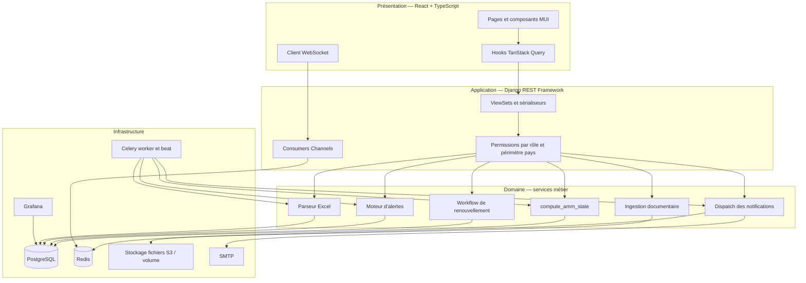

### 2.2 Vue déploiement

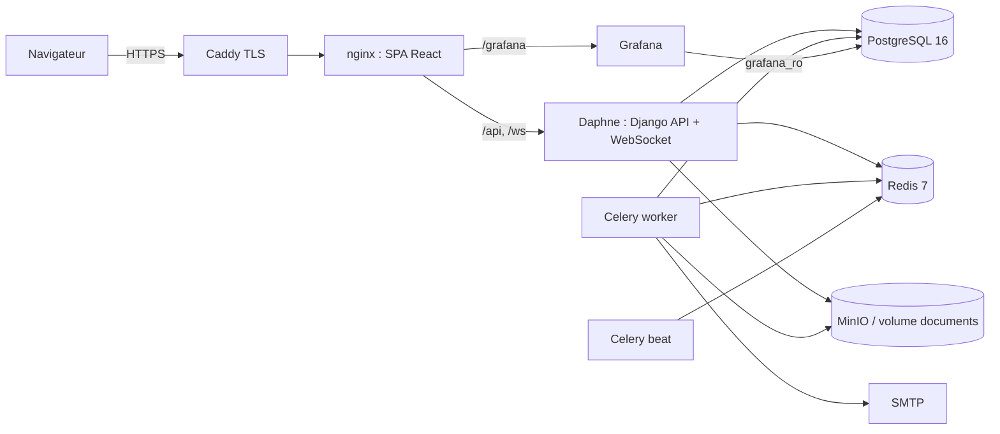

### 2.3 Modules backend et dépendances

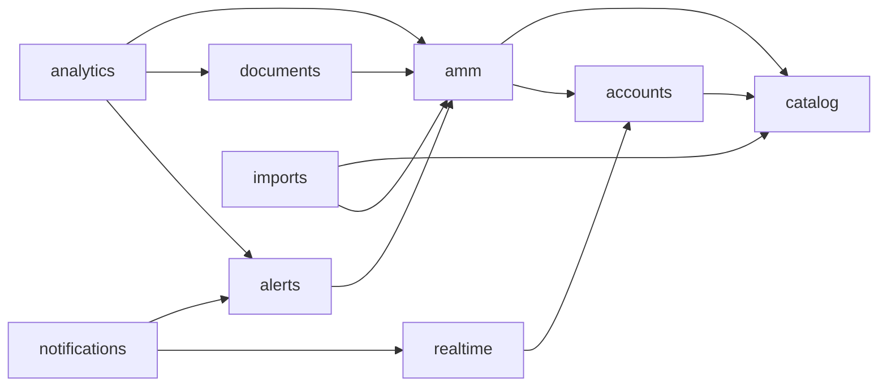

---

## 3. Diagramme de cas d'utilisation

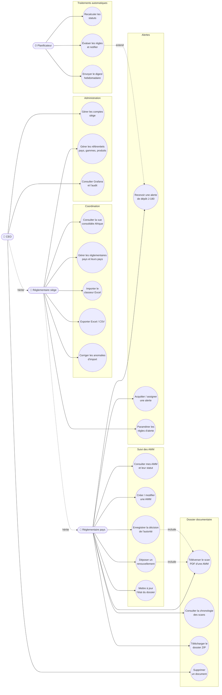

### 3.1 Fiches des cas d'utilisation majeurs

**UC3 — Déposer un renouvellement**
- Acteur : réglementaire pays.
- Précondition : AMM dans son périmètre ; renouvellement en `PLANIFIE` ou `EN_PREPARATION` (créé automatiquement à l'alerte J-365 ou manuellement).
- Scénario nominal : ouvrir la fiche AMM → onglet Renouvellements → « Déposer » → saisir la date de dépôt, joindre le récépissé PDF → valider.
- Postconditions : renouvellement en `DEPOSE` ; alertes J-180/J-90/J-30 ouvertes résolues en `AUTO_FILED` ; statut AMM `IN_PROCESS` si l'AMM d'origine est expirée, sinon inchangé ; urgence `EN_INSTRUCTION` ; événement temps réel diffusé au pays et au siège ; entrée d'audit.
- Exceptions : date de dépôt manquante → refus ; transition invalide → refus avec message.

**UC4 — Enregistrer la décision de l'autorité**
- Précondition : renouvellement en `DEPOSE` ou `EN_INSTRUCTION`.
- Nominal : « Obtenu » → saisir le nouveau numéro, la date de début (date de fin calculée +5 ans, modifiable), joindre le scan de l'AMM → valider.
- Postconditions : renouvellement `OBTENU` ; date de fin effective mise à jour ; statut `VALIDE` ; alertes résolues `AUTO_RENEWED` ; le scan devient le premier élément de la chronologie documentaire avec le badge « En vigueur ».
- Alternative : « Rejeté » → date de décision et motif ; un nouveau renouvellement peut être planifié.

**UC14 — Gérer les réglementaires pays**
- Acteur : réglementaire siège.
- Nominal : créer un compte (email, nom, mot de passe initial), rôle `COUNTRY_REGULATORY`, cocher les pays → enregistrer. Le compte reçoit immédiatement les alertes de ses pays.
- Règles : le siège ne peut créer ni modifier un compte `HQ_REGULATORY` ou `CEO_ADMIN` ; la désactivation est immédiate (jeton révoqué).

**UC22 — Évaluer les règles et notifier** (automatique, 00:15)
- Pour chaque AMM et chaque règle applicable, créer l'alerte si l'échéance est atteinte et qu'elle n'existe pas encore ; notifier les destinataires selon leur rôle et leur périmètre ; envoyer les emails.

---

## 4. Diagramme de classes

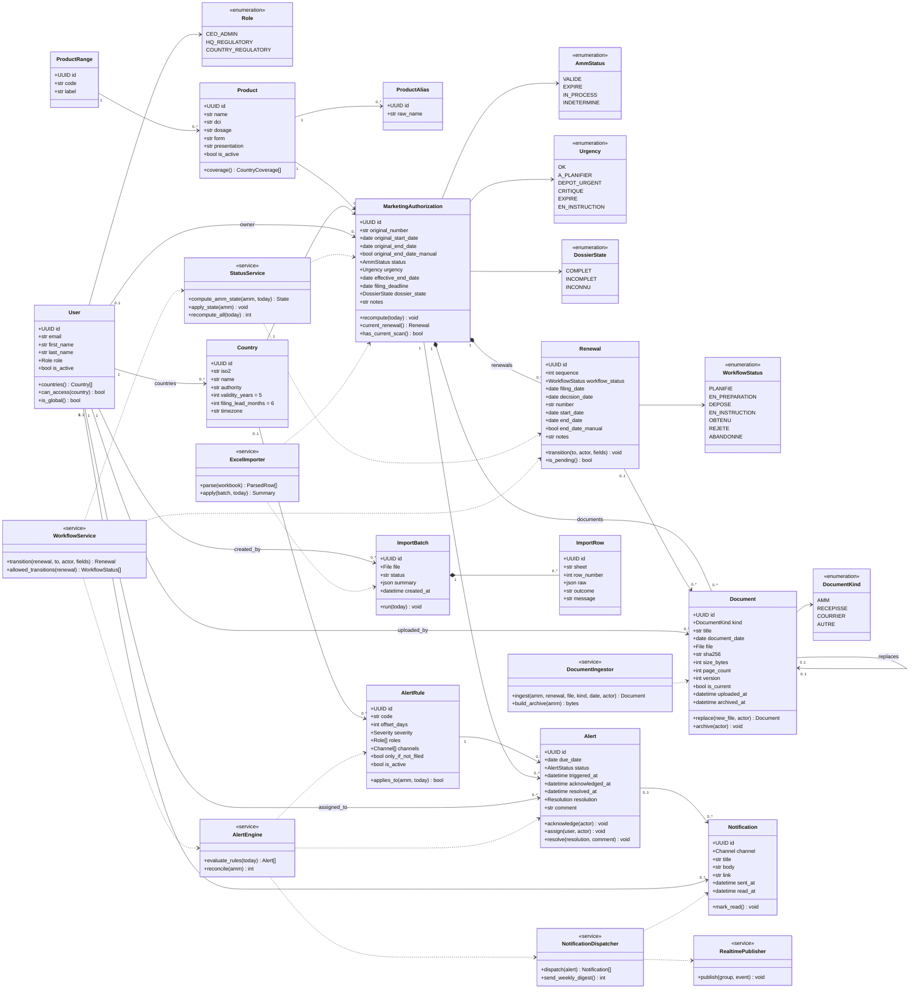

### 4.1 Invariants
- Une `MarketingAuthorization` est unique par (produit, pays).
- Au plus un `Renewal` non terminal (`PLANIFIE`, `EN_PREPARATION`, `DEPOSE`, `EN_INSTRUCTION`) par AMM.
- `Alert` unique par (AMM, règle, échéance).
- `Document.is_current` est vrai pour au plus un document par chaîne de versions.
- `status`, `urgency`, `effective_end_date` et `filing_deadline` ne sont jamais saisis : ils sont toujours produits par `StatusService`.

---

## 5. Diagrammes de séquence

### 5.1 Connexion et chargement du périmètre

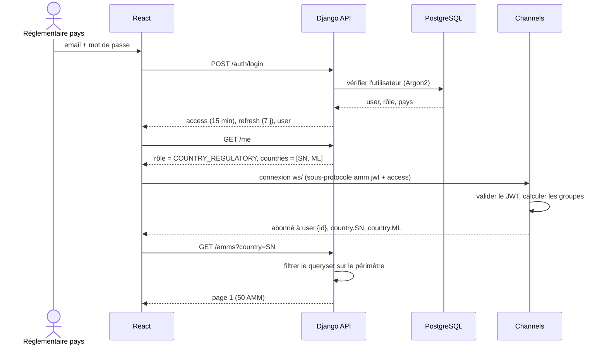

### 5.2 Dépôt d'un renouvellement avec résolution automatique de l'alerte et diffusion temps réel

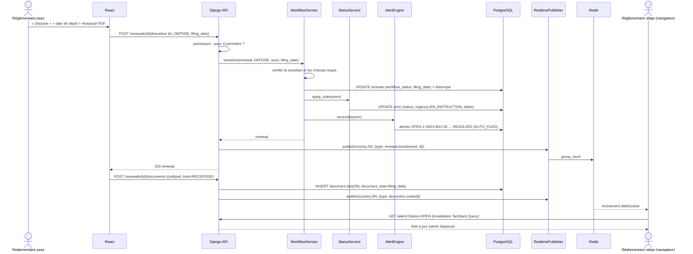

### 5.3 Traitement nocturne : recalcul, évaluation des règles, notification J-180

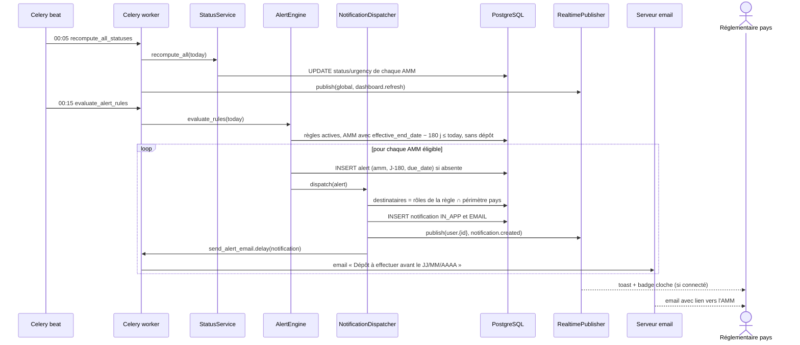

### 5.4 Téléversement d'un scan d'AMM et consultation en chronologie inverse

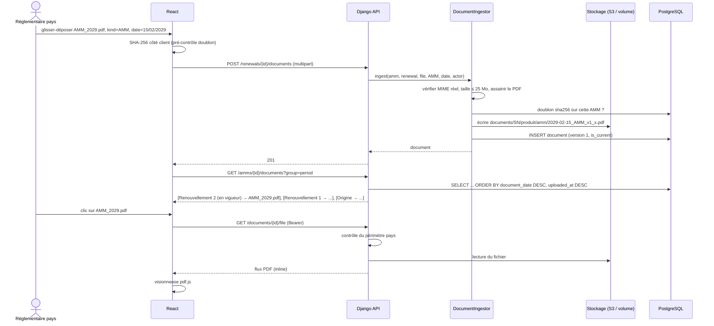

### 5.5 Import du classeur Excel par le siège

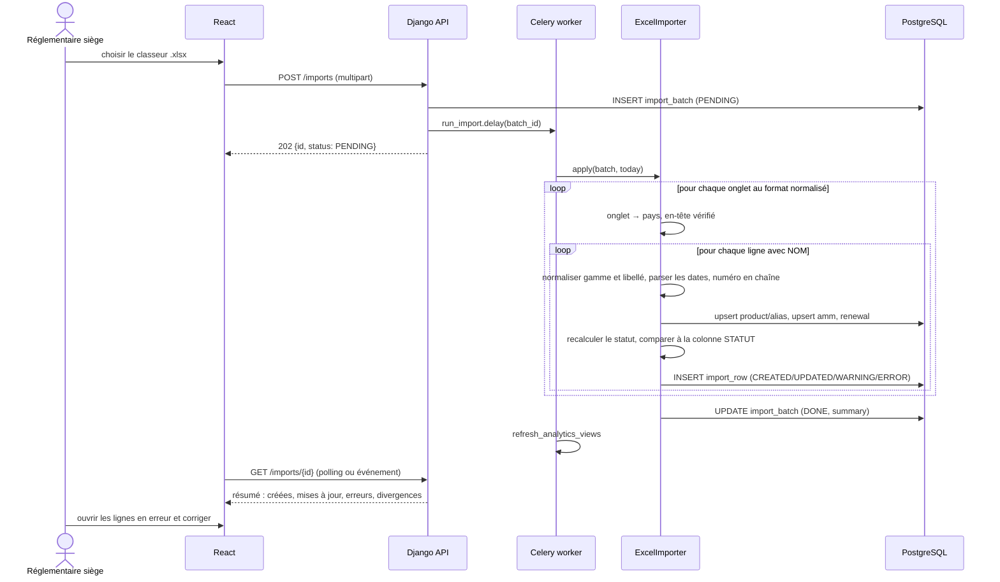

---

## 6. Diagrammes d'activités

### 6.1 Cycle de vie d'une AMM et processus de renouvellement

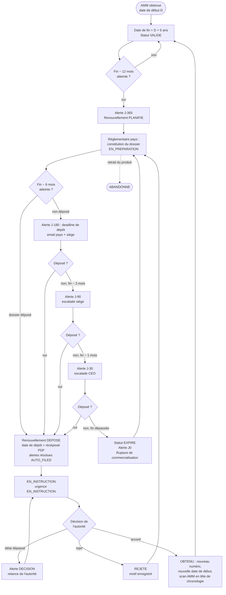

### 6.2 Traitement nocturne automatique

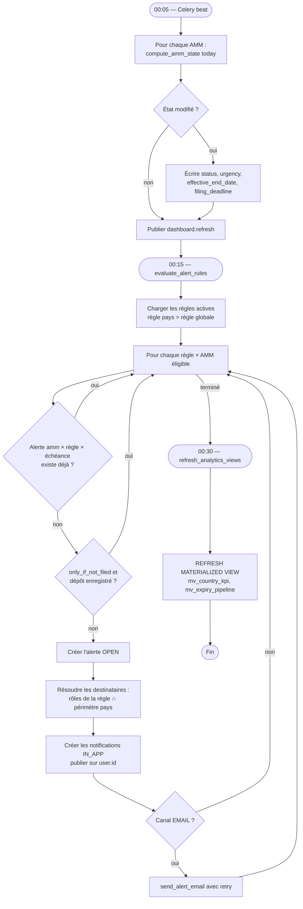

### 6.3 Coordination par le réglementaire siège

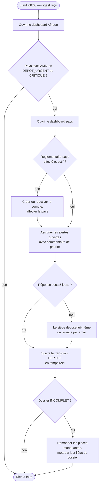

### 6.4 Téléversement et classement d'un document

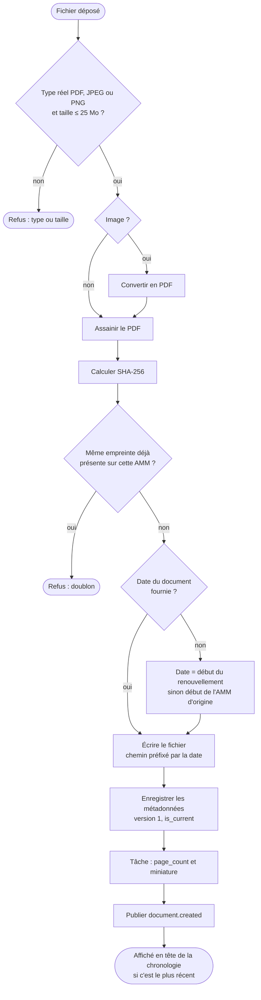

---

## 7. Matrice rôles × cas d'utilisation

| Cas d'utilisation | Réglementaire pays | Réglementaire siège | CEO |
|---|---|---|---|
| Consulter les AMM | Ses pays | Tous | Tous |
| Créer / modifier une AMM | Ses pays | Tous | Tous |
| Déposer / faire aboutir un renouvellement | Ses pays | Tous | Tous |
| Téléverser, remplacer un document | Ses pays | Tous | Tous |
| Supprimer (archiver) un document | — | — | ✔ |
| Acquitter / assigner une alerte | Ses pays | Tous | Tous |
| Paramétrer les règles d'alerte | — | ✔ | ✔ |
| Gérer les réglementaires pays | — | ✔ | ✔ |
| Gérer les comptes siège | — | — | ✔ |
| Gérer les référentiels | — | ✔ | ✔ |
| Importer / exporter | Export de ses pays | ✔ | ✔ |
| Dashboards Afrique et Grafana | Ses pays | ✔ | ✔ |
| Consulter l'audit | Ses pays | ✔ | ✔ |

---

## 8. Correspondance conception → code

| Élément de conception | Emplacement dans le code |
|---|---|
| Classes métier | `backend/apps/<app>/models.py` |
| `StatusService` | `backend/apps/amm/services/status.py` |
| `WorkflowService` | `backend/apps/amm/services/workflow.py` |
| `AlertEngine` | `backend/apps/alerts/services/engine.py` |
| `NotificationDispatcher` | `backend/apps/notifications/services.py` |
| `DocumentIngestor` | `backend/apps/documents/services/ingest.py` |
| `ExcelImporter` | `backend/apps/imports/excel_parser.py` |
| `RealtimePublisher` | `backend/apps/realtime/publisher.py` |
| Permissions rôle × périmètre | `backend/apps/accounts/permissions.py` |
| Tâches planifiées | `backend/config/celery.py`, `backend/apps/*/tasks.py` |
| Écrans | `frontend/src/features/*` |
| Client temps réel | `frontend/src/realtime/` |
| Dashboards Grafana | `grafana/dashboards/` |
| Pipeline CI/CD | `.github/workflows/` |
