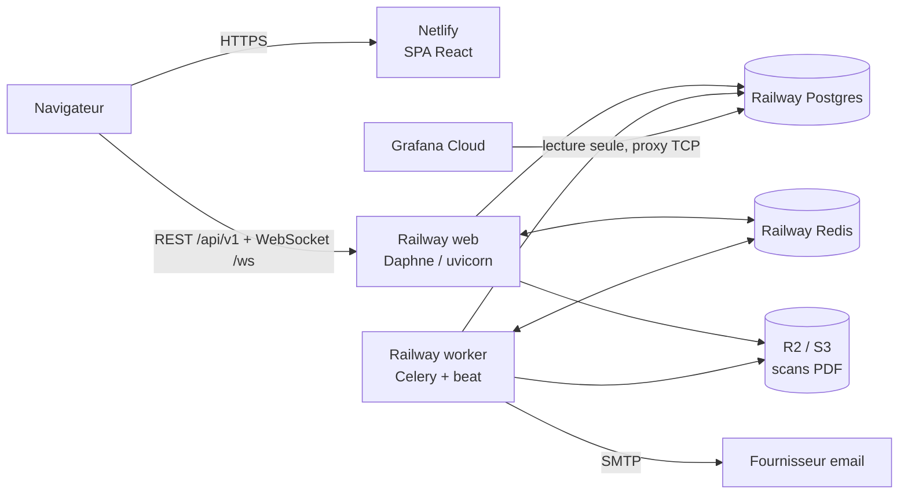

# Déploiement : Netlify (frontend) + Railway (backend, Redis, PostgreSQL)

Architecture retenue pour la 1.0 :

| Composant | Hébergement | Fichier de configuration |
|---|---|---|
| Frontend React (SPA) | Netlify, CDN, HTTPS automatique | [netlify.toml](../netlify.toml) |
| API + WebSocket | Railway, service Docker `amm-innov-backend` | [railway.json](../railway.json) |
| Celery worker + beat | Railway, service Docker `amm-innov-worker` (1 réplique), variable `AMM_ROLE=worker` | [railway.json](../railway.json) |
| Redis (broker, channel layer, cache) | Railway, service Redis | variables de référence |
| PostgreSQL 16 | Railway, service Postgres | variables de référence |
| Scans PDF | Bucket Railway (S3 compatible, même région que les services) | variables `S3_*` |
| Grafana | Grafana Cloud (gratuit) branché sur la base Railway (proxy TCP) | dashboards `grafana/dashboards/` |
| Emails | Fournisseur SMTP (Brevo, SendGrid, Resend…) | `EMAIL_URL` |

Le frontend appelle l'API directement sur le domaine Railway (CORS), sans proxy Netlify :
les proxys Netlify coupent les requêtes longues, ce qui casserait l'envoi de PDF de 25 Mo
sur une connexion lente.



Coût indicatif (septembre 2026) : Railway plan Hobby 5 $ par mois incluant 5 $ d'usage, puis
facturation à la ressource (mémoire, CPU, disque, sortie réseau). Pour cette application :
web ~0,5 Go, worker ~0,3 Go, Postgres et Redis ~0,3 Go, soit **10 à 15 $ par mois** au total.
Netlify gratuit, R2 gratuit sous 10 Go, Grafana Cloud gratuit. Le plan Trial de Railway
(crédit unique) suffit pour une démonstration, pas pour la production (services arrêtés à
épuisement du crédit).

---

## 1. Prérequis

- Dépôt GitHub `alamine2003/AMM-INNOV` avec la CI verte sur `main`.
- Un compte Railway (plan Hobby), un compte Netlify, un compte Cloudflare (R2) ou équivalent S3.
- Un moyen d'envoyer des e-mails. **Attention : Railway bloque tous les ports SMTP sortants**
  (25, 465, 587, 2525) ; seul le port 443 passe. Un serveur SMTP classique, Gmail compris, est
  donc inutilisable. Voir l'étape 2 bis.
- Le classeur Excel de référence pour l'import initial.

## 1 bis. Un domaine commun pour la session

Le refresh token est un cookie `httpOnly` posé par l'API. Un cookie n'est envoyé au
rafraîchissement que si le frontend et l'API sont sur le **même site** : prévoir un domaine et
deux sous-domaines, par exemple `app.amm-innov.com` (Netlify) et `api.amm-innov.com` (Railway,
Settings, Networking, Custom Domain), avec `AUTH_REFRESH_COOKIE_DOMAIN=.amm-innov.com`,
`AUTH_REFRESH_COOKIE_SAMESITE=Lax`, `ALLOWED_HOSTS`, `CORS_ALLOWED_ORIGINS`,
`CSRF_TRUSTED_ORIGINS`, `FRONTEND_URL` et `netlify.toml` ajustés en conséquence.

Pour un essai sur `*.netlify.app` et `*.up.railway.app` (deux sites différents), mettre
`AUTH_REFRESH_COOKIE_SAMESITE=None` et laisser le domaine vide : Chrome et Firefox acceptent ce
cookie tiers, Safari le bloque (l'utilisateur est déconnecté au bout de 15 minutes).

## 2. Stockage S3 des scans PDF

Sur Railway, le service web (qui reçoit les uploads) et le worker (qui lit les PDF) n'ont
pas de disque partagé : le stockage objet est obligatoire. **Il sert aussi aux classeurs
d'import** : sans lui, le worker ne peut pas lire le fichier que le web vient de recevoir et
le lot reste « En attente ».

Railway fournit des buckets S3 compatibles, dans les mêmes régions que les services (c'est
la solution retenue pour la 1.0) :

```bash
railway bucket create amm-documents --region ams     # ams = EU West, comme les services
railway bucket credentials --bucket amm-documents --json
```

La commande renvoie `endpoint`, `bucketName` (suffixé par Railway), `accessKeyId` et
`secretAccessKey`, à reporter dans `S3_ENDPOINT_URL`, `S3_BUCKET`, `S3_ACCESS_KEY` et
`S3_SECRET_KEY`, avec `S3_REGION=auto` et **`S3_ADDRESSING_STYLE=virtual`** (Railway adresse
les buckets par sous-domaine ; Cloudflare R2 et MinIO utilisent `path`).

Autre possibilité, un bucket privé Cloudflare R2 (`https://<account-id>.r2.cloudflarestorage.com`,
`S3_ADDRESSING_STYLE=path`) ou tout stockage S3 compatible.

Les fichiers ne sont jamais servis directement depuis le bucket : l'API vérifie le périmètre
pays puis diffuse le PDF, le bucket peut donc rester entièrement privé.

## 2 bis. E-mails : l'API Gmail (le SMTP est bloqué)

Vérifié depuis un conteneur Railway : `smtp.gmail.com` sur 25, 465 et 587, ainsi que les relais
Brevo, SendGrid et Mailgun sur 2525, expirent tous ; `api.brevo.com:443` et
`smtp.resend.com:2465` répondent. L'application sait donc envoyer par **l'API Gmail en HTTPS**
(`EMAIL_URL=gmail://`, backend `apps.notifications.backends.GmailApiBackend`).

1. **Projet Google Cloud** : console.cloud.google.com, créer un projet (`AMM INNOV`).
2. **Activer l'API Gmail** : APIs & Services, Library, chercher « Gmail API », Enable.
3. **Écran de consentement** : APIs & Services, OAuth consent screen, type **External**,
   nom de l'application, adresse d'assistance et de contact. Laisser en mode **Testing** et
   ajouter l'adresse expéditrice dans **Test users**. Portée à ajouter :
   `https://www.googleapis.com/auth/gmail.send` (envoi seul, aucune lecture).
4. **Identifiants** : Credentials, Create credentials, **OAuth client ID**, type
   **Desktop app**. Google affiche un identifiant et un secret.
5. **Jeton de rafraîchissement**, une seule fois, depuis un poste avec navigateur :
   ```bash
   python3 scripts/gmail_oauth.py --client-id <ID> --client-secret <SECRET>
   ```
   Le script ouvre la page de consentement, récupère le code sur `http://localhost`, et affiche
   `GMAIL_REFRESH_TOKEN=…`.
6. **Variables du service web et du worker** :
   ```
   EMAIL_URL=gmail://
   GMAIL_CLIENT_ID=…
   GMAIL_CLIENT_SECRET=…
   GMAIL_REFRESH_TOKEN=…
   DEFAULT_FROM_EMAIL=AMM INNOV <adresse-du-compte@gmail.com>
   ```
   L'adresse de `DEFAULT_FROM_EMAIL` doit être celle du compte autorisé, sinon Gmail réécrit
   l'expéditeur. Un compte Gmail gratuit est limité à environ 500 messages par jour.

En mode **Testing**, le jeton de rafraîchissement expire au bout de 7 jours : passer l'écran de
consentement en **In production** (bouton « Publish app ») pour un jeton durable. L'application
ne demandant qu'une portée non sensible d'envoi, aucune vérification Google n'est requise.

Avec un nom de domaine (par exemple `innovpharma.net`), un service transactionnel donne une
meilleure délivrabilité : Resend fonctionne depuis Railway par SMTP sur le port **2465**
(`smtps://resend:<clé>@smtp.resend.com:2465`), sans code supplémentaire.

## 3. Railway : créer le projet

Railway ne lit pas de fichier de variables : `railway.json` décrit le build et le démarrage
d'un service, les variables se saisissent dans le tableau de bord (ou avec la CLI,
`railway variables --set`). Un projet, quatre services.

### 3.1 Base et Redis

1. Railway, **New Project**, **Deploy PostgreSQL**. Dans le service Postgres, Settings,
   **TCP Proxy** : à activer plus tard pour Grafana Cloud et les sauvegardes (étapes 6 et 7).
2. Dans le projet, **+ New, Database, Redis**.

### 3.2 Service web `amm-innov-backend`

Avec la CLI, l'équivalent des étapes 1, 2 et 4 tient en trois commandes (c'est ainsi que la 1.0 a
été mise en ligne) :

```bash
railway add -s amm-innov-backend -r alamine2003/AMM-INNOV --branch main
railway domain -s amm-innov-backend
railway variables -s amm-innov-backend --set "DJANGO_SETTINGS_MODULE=config.settings.prod" --set ...
```

1. **+ New, GitHub Repo**, choisir `AMM-INNOV`, branche `main`. Railway détecte
   `railway.json` : build Docker avec `docker/backend.Dockerfile` (contexte = racine du dépôt,
   `.dockerignore` respecté), démarrage `entrypoint.sh serve`, sonde `/api/v1/health`.
   Laisser **Root Directory** vide (racine du dépôt) : le Dockerfile copie `backend/` et `docker/`.
   La variable `RAILWAY_DOCKERFILE_PATH=docker/backend.Dockerfile` force ce build même si
   Railway a d'abord détecté le projet autrement.
2. Settings, **Networking, Generate Domain** : Railway propose un domaine
   `amm-innov-backend-production-xxxx.up.railway.app`, renommable (par exemple
   `amm-innov-backend-production.up.railway.app` s'il est libre). Le port demandé est celui de la variable
   `PORT` ; laisser Railway le fixer.
3. Settings, **Deploy, Wait for CI** : cocher, pour ne déployer qu'après la CI GitHub verte.
4. Variables (onglet **Variables**, bouton **Raw Editor** pour coller le bloc) :

   ```
   DJANGO_SETTINGS_MODULE=config.settings.prod
   DJANGO_SECRET_KEY=<python -c "import secrets; print(secrets.token_urlsafe(64))">
   DATABASE_URL=${{Postgres.DATABASE_URL}}
   REDIS_URL=${{Redis.REDIS_URL}}
   BIND_HOST=::
   WEB_CONCURRENCY=1
   NUM_PROXIES=1
   ALLOWED_HOSTS=amm-innov-backend-production.up.railway.app
   CORS_ALLOWED_ORIGINS=https://amm-innov.netlify.app
   CSRF_TRUSTED_ORIGINS=https://amm-innov-backend-production.up.railway.app
   FRONTEND_URL=https://amm-innov.netlify.app
   AUTH_REFRESH_COOKIE_SAMESITE=None
   AUTH_REFRESH_COOKIE_DOMAIN=
   TIME_ZONE=Africa/Dakar
   EMAIL_URL=gmail://
   GMAIL_CLIENT_ID=<étape 2 bis>
   GMAIL_CLIENT_SECRET=<étape 2 bis>
   GMAIL_REFRESH_TOKEN=<étape 2 bis>
   DEFAULT_FROM_EMAIL=AMM INNOV <adresse-du-compte@gmail.com>
   DOCUMENT_STORAGE=s3
   S3_ENDPOINT_URL=<endpoint du bucket Railway>
   S3_BUCKET=<bucketName renvoyé par Railway>
   S3_ACCESS_KEY=<jeton R2>
   S3_SECRET_KEY=<secret R2>
   S3_REGION=auto
   S3_ADDRESSING_STYLE=virtual
   DOCUMENT_MAX_MB=25
   ALERTS_DISPATCH_MAX_AGE_DAYS=30
   DB_POOL_MAX_SIZE=20
   GRAFANA_DB_PASSWORD=<mot de passe du rôle grafana_ro>
   METRICS_TOKEN=<jeton du scrape Prometheus, optionnel>
   WAIT_TIMEOUT=120
   SENTRY_DSN=<DSN du projet Sentry « backend », optionnel, voir 6 bis>
   SENTRY_ENVIRONMENT=production
   SENTRY_RELEASE=${{RAILWAY_GIT_COMMIT_SHA}}
   ```

   `${{Postgres.DATABASE_URL}}` et `${{Redis.REDIS_URL}}` sont des **références** Railway : elles
   pointent vers le réseau privé (`postgres.railway.internal`, IPv6), d'où `BIND_HOST=::`.
   L'hôte public attribué (`RAILWAY_PUBLIC_DOMAIN`) et l'hôte privé sont acceptés d'office par
   l'API ; `ALLOWED_HOSTS` sert surtout pour un domaine personnalisé.
5. Déployer. Le premier déploiement construit l'image (4 à 6 minutes), applique les migrations
   et collecte les statiques (entrypoint). Vérifier
   `https://<domaine>/api/v1/health` : `{"status":"ok","database":true,"redis":true}`.
6. Commandes dans le conteneur : enregistrer une clé SSH une fois
   (`railway ssh keys add -k ~/.ssh/id_ed25519.pub`), puis
   `railway ssh -s amm-innov-backend -- python manage.py <commande>`.
7. Premier compte administrateur : ajouter les variables `DJANGO_SUPERUSER_EMAIL` et
   `DJANGO_SUPERUSER_PASSWORD` au service web ; l'entrypoint crée le compte (rôle CEO,
   accès admin) au démarrage suivant et l'ignore ensuite s'il existe. Retirer
   `DJANGO_SUPERUSER_PASSWORD` après la première connexion et changer le mot de passe dans
   l'application. (`railway ssh` reste possible après `railway ssh keys github`.)

### 3.3 Service worker `amm-innov-worker`

1. **+ New, GitHub Repo**, le même dépôt : même `railway.json`, même image.
2. Variables : les mêmes que le service web (Raw Editor, coller le même bloc) **plus**
   `AMM_ROLE=worker` (l'entrypoint lance alors Celery avec beat intégré au lieu du serveur web),
   `RUN_MIGRATIONS=0`, `COLLECT_STATIC=0`, `DB_POOL_MAX_SIZE=4`. Ne pas générer de domaine.
3. **Une seule réplique** : beat est intégré au worker, deux répliques exécuteraient les jobs
   nocturnes en double.

Le worker attend que le service web ait appliqué les migrations avant de démarrer (entrypoint).

### 3.4 Remarques

- Mémoire : mesuré 236 Mo pour deux workers uvicorn à vide, 235 Mo pour un processus sous
  charge. `WEB_CONCURRENCY=2` est raisonnable sur Railway (mémoire facturée à l'usage, pas de
  plafond dur sur Hobby) ; garder `WEB_CONCURRENCY × DB_POOL_MAX_SIZE` sous la limite de
  connexions Postgres (100 par défaut).
- Le WebSocket accepte les origines de `CORS_ALLOWED_ORIGINS` : le site Netlify doit y figurer.
- Redéploiement : à chaque push sur `main` si l'application GitHub de Railway est installée sur
  le dépôt (Settings du service, Source : « Connect GitHub » si ce n'est pas le cas). Sinon, à la
  demande : `make deploy-backend` (`railway redeploy --from-source` sur les deux services).
- Domaine personnalisé : Settings, Networking, Custom Domain (`api.amm-innov.com`) puis
  variables de l'étape 1 bis.

## 4. Netlify : déployer le frontend

Le site `amm-innov` existe (https://amm-innov.netlify.app), lié au dossier du dépôt par
`.netlify/` (hors git).

**La publication se fait par la CI**, job `netlify` de `.github/workflows/ci.yml` : sur un push
vers `main`, après le passage au vert du backend et du frontend. Deux secrets sont requis dans
Settings, Secrets and variables, Actions :

| Secret | Où le trouver |
|---|---|
| `NETLIFY_AUTH_TOKEN` | Netlify, User settings, Applications, **New access token** |
| `NETLIFY_SITE_ID` | Netlify, Site configuration, Site details, **Site ID** |

Sans eux le job n'échoue pas : il inscrit un avertissement et passe son tour.

Ce chemin publie **l'état commité**, et seulement s'il est vert. La CLI locale
(`make deploy-frontend`), elle, construit le dossier de travail : elle publierait des
modifications non commitées — c'est arrivé. Elle reste disponible en dépannage, mais refuse
désormais de s'exécuter sur un dépôt non propre (`FORCE=1` pour outrepasser).

Alternative sans secrets, si vous préférez : Netlify, Site configuration, Build & deploy,
**Link repository** (autorisation GitHub dans le navigateur). Netlify construit alors lui-même à
chaque push, mais sans attendre la CI — activer « Deploy only when checks pass » pour l'aligner.
Dans ce cas, supprimer le job `netlify` de la CI pour ne pas publier deux fois.

1. Netlify, **Add new site, Import an existing project**, choisir le dépôt. Netlify lit
   `netlify.toml` : build `cd frontend && npm ci && npm run build`, publication
   `frontend/dist`, Node 24, et les deux variables `VITE_API_BASE` et `VITE_WS_URL`.
2. **Reporter le domaine Railway** de l'étape 3.2.2 dans `netlify.toml` (`VITE_API_BASE`,
   `VITE_WS_URL`) si ce n'est pas `amm-innov-backend-production.up.railway.app`, ou le saisir dans
   Site configuration, Environment variables (prioritaire sur le fichier).
   Au même endroit, `VITE_SENTRY_DSN` (DSN du projet Sentry « frontend », optionnel, voir 6 bis)
   et `VITE_SENTRY_ENVIRONMENT=production`.
3. Site name : `amm-innov` (donne `https://amm-innov.netlify.app`). Si un autre nom ou un
   domaine personnalisé est utilisé, mettre à jour `CORS_ALLOWED_ORIGINS` et `FRONTEND_URL`
   côté Railway (les liens des emails d'alerte utilisent `FRONTEND_URL`).
4. Déployer. Se connecter avec le superutilisateur créé à l'étape 3.2.6, puis créer les
   comptes siège et pays dans Administration, Utilisateurs.


## 5. Mise en service des données

Depuis un shell dans le conteneur web (`railway ssh -s amm-innov-backend -- <commande>`) :

```bash
# 1. Référentiels et règles d'alerte par défaut
python manage.py seed_alert_rules

# 2. Import du classeur : depuis l'application, Administration > Imports, en cochant
#    « Simulation » pour un premier passage à blanc, puis sans la case pour l'import réel.
#    (Le stockage S3 de l'étape 2 est indispensable : le worker lit le fichier déposé par le web.)

# 3. Doublons de produits issus du classeur : fusion des groupes sans conflit
python manage.py product_duplicates --merge

# 4. Alertes historiques SANS notification (évite plus d'un millier d'emails le premier jour)
python manage.py evaluate_alerts --quiet
```

Le passage nocturne (00:15 Dakar) ne notifiera ensuite que les nouvelles alertes.
Ne pas lancer `seed_demo` en production : il crée des comptes avec un mot de passe connu.

## 6. Grafana Cloud

1. Créer une stack gratuite sur grafana.com.
2. Railway, service Postgres, Settings, **TCP Proxy** : activer ; Railway donne un hôte et un
   port publics (`xxx.proxy.rlwy.net:NNNNN`). La base reste protégée par mot de passe ;
   utiliser le rôle `grafana_ro` (lecture seule sur le schéma `analytics`), jamais le compte
   principal.
3. Data source PostgreSQL : cet hôte et ce port, base `railway`, utilisateur `grafana_ro`, mot
   de passe `GRAFANA_DB_PASSWORD`, TLS `require`. Le rôle `grafana_ro` est créé par la migration
   `analytics`. Si elle n'a pas pu le créer (privilèges), le créer via `psql` sur le proxy TCP :
   ```sql
   CREATE ROLE grafana_ro LOGIN PASSWORD '<GRAFANA_DB_PASSWORD>';
   GRANT USAGE ON SCHEMA analytics TO grafana_ro;
   GRANT SELECT ON ALL TABLES IN SCHEMA analytics TO grafana_ro;
   ALTER DEFAULT PRIVILEGES IN SCHEMA analytics GRANT SELECT ON TABLES TO grafana_ro;
   ```
4. Importer les cinq dashboards JSON de `grafana/dashboards/` (Dashboards, New, Import) en
   sélectionnant cette source de données. Le dashboard « Technique » a besoin de Prometheus ;
   Grafana Cloud fournit un Prometheus hébergé qui peut scraper `/metrics` du backend
   (renseigner `METRICS_TOKEN` côté Railway et le même jeton en « Bearer » dans la configuration
   du scrape).

## 6 bis. Sentry (surveillance des erreurs, optionnel)

Sans Sentry, les erreurs ne sont visibles que dans les journaux Railway. Avec, chaque exception du
web, du worker ou de l'interface devient un incident daté, regroupé, avec sa pile d'appels et le
`request_id` des journaux JSON (docs/audit-resilience/RAPPORT.md, section Observabilité).

1. Sur sentry.io, créer une organisation, puis deux projets : **Django** (nommé `amm-innov-backend`)
   et **React** (`amm-innov-frontend`). Chaque projet donne un DSN.
2. Railway : `SENTRY_DSN` sur le service web **et** sur le worker (bloc de l'étape 3.2.4) ;
   `SENTRY_RELEASE=${{RAILWAY_GIT_COMMIT_SHA}}` relie chaque erreur au commit déployé.
3. Netlify : `VITE_SENTRY_DSN` (étape 4.2).
4. Vérifier : Railway, service web, **Shell** :
   `python -c "import django; django.setup(); import sentry_sdk; sentry_sdk.capture_message('test AMM INNOV')"`
   fait apparaître un événement dans le projet backend en moins d'une minute.
5. Sentry, Alerts : une règle « nouvel incident → e-mail » par projet suffit pour commencer.

Ce qui n'est pas envoyé, par construction (`backend/config/sentry.py`) : adresse IP, cookies,
en-têtes d'authentification, corps des requêtes (scans, fiches d'AMM). L'utilisateur n'est
désigné que par son identifiant interne. Les traces de performance restent désactivées
(`SENTRY_TRACES_SAMPLE_RATE=0`) ; les sondes `/api/v1/health` et `/metrics` en sont exclues.

## 7. Sauvegardes

Railway conserve des sauvegardes de Postgres (quotidiennes sur le plan Pro ; sur Hobby, vérifier
l'offre en vigueur). Pour une copie externalisée, via le proxy TCP, depuis n'importe quelle
machine avec Docker :

```bash
docker run --rm -e PGPASSWORD='<mot de passe>' postgres:16 \
  pg_dump -h <hote>.proxy.rlwy.net -p <port> -U postgres -d railway --no-owner \
  | gzip > amm-db-$(date +%Y%m%d).sql.gz
```

Les scans PDF sont dans le bucket S3 : activer le versionnement du bucket, ou le répliquer
(`rclone sync`), suffit.

## 8. Vérifications après déploiement

- `GET /api/v1/health` renvoie `database: true, redis: true`.
- Connexion sur Netlify, l'indicateur temps réel passe à « connecté » (WebSocket direct vers Railway).
- Envoi d'un PDF depuis une fiche AMM, puis ouverture dans la visionneuse (stockage S3).
- Railway, service worker, logs : `celery@… ready` et `beat: Starting…`, puis à 00:05 Dakar
  `recompute_all_statuses` et à 00:15 `evaluate_alert_rules`.
- Un email d'alerte de test arrive (créer une AMM à 100 jours de sa fin).
- Si Sentry est configuré : l'événement de test de l'étape 6 bis.4 est visible.

## 9. Ce qui ne s'applique plus

`docker-compose.prod.yml`, `docker/Caddyfile` et le workflow GitHub **Deploy** (SSH) restent
disponibles pour un serveur unique auto-hébergé ; ils ne sont pas utilisés avec Netlify + Railway.
